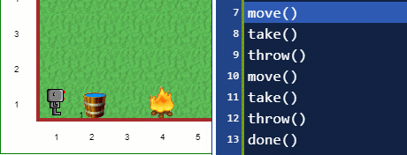

Worlds can be more visually interesting by adding animated tiles. To create an animation, a series of different images is associated with a given object. All tiles are animated (i.e. the image shown changes) at a set interval, which is independent of the animation time use to show each excution step of the program.
The default is 120 ms; this is reset whenever a world is loaded and can be changed for a given world
by assigning a value to `RUR.ANIMATION_TIME` in the Onload or Pre editor.

![animation][animated]

Currently, 5 different types of animations are supported.

1. All animated images of a given type cycle through at the same time. This is shown on the bottom row (`y=2`) in the animated image below where I have chosen to represent all animated tiles in by the same images (numbers from 1 to 5). The animation time has been slowed down from the default.
2. Each animated tile cycle through an orderly fashion, but starts at a random point in a cycle. This is shown on the second bottom row (`y=4`) below. Note that two of the tiles shown here happen to cycle in synchronicity with those of the bottom row.
3. Each animated tile changes randomly at each cycle. This is shown on the `y=6` row.
4. A single cycle through all the images is done; after it is completed, the last image is shown repeatedly. (Currently, it is redrawn each time, even when it is not changing). This is shown on the `y=8` row.
5. A single cycle is done after which the tile/object is removed from the world. This cannot realistically
be used for objects which cannot be picked up by the robot.

[animated]: ../../src/images/animated_tiles.gif

The image above was done using a slightly modified version of
`World("/worlds/examples/animated_all.json", "animated")`.
Load up this world and click on **World Info** for details.

As a concrete example for built-in objects, in the image below, "fire" is
an animated image with random cycle. When it is put out, it is replaced
by "smoke" which is an animated image with a single cycle.

## Main tutorial guide

See {@tutorial how}.