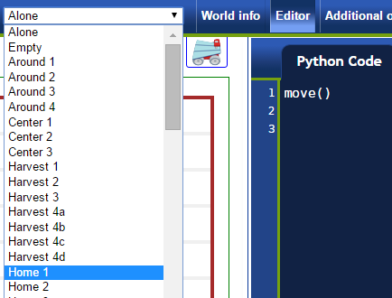
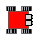

Task driven learning
====================

In order to help you learn Python, I will give you some tests: you
have to program Reeborg to accomplish specific tasks and Reeborg itself
will tell you if you got it right or wrong.

Select the world **Home 1**. Notice the house on the bottom left square:
this is Reeborg's home. Reeborg's world is a simple grid.
In **Home 1**, Reeborg starts at the third square on the bottom row. It
labels this square as ``x=3`` and ``y=1``, using what is known as
Cartesian coordinates.

.. topic:: Try this!

    With **Home 1** selected, write a program with a single ``move()`` instruction,
    run it and notice what feedback Reeborg gives you.
    Then, change your program so that
    Reeborg go home.

.. topic:: Try two more!

    Select **Home 2**. Notice how Reeborg is in a different location and is also
    facing you. Try running the exact same program and see what happens.

    Next, select **Home 3** and run your program.

.. index:: turn_left()

Making a left turn
------------------

Last example ended with a program that did not work, as Reeborg
did not end up at his home.  To solve this problem, we need to
add two instructions::

    turn_left()
    move()

.. topic:: Try this!

    Make sure that Reeborg goes home in **Home 3**.

.. topic:: Try something else!

    What happens if, you leave out the ``turn_left()`` instruction, but
    keep the additional ``move()`` instruction?

A different view
----------------

.. |image0| image:: ../../../src/images/robot_e.png

You may have noticed that Reeborg (the robot itself) is seen from its
side, such as |image0| whereas his world is seen from above ... which
you might perhaps find confusing especially when you instruct Reeborg to
turn left. You can change the way Reeborg is seen by either using the
clicking on the appropriate image above Reeborg's world.
For example, when facing East, such as the side view above, using a different
image, Reeborg can appear as follows when viewed from above: |image1|
