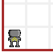
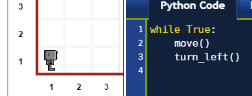
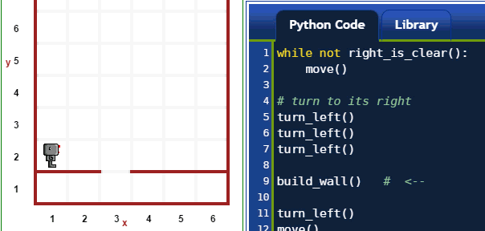
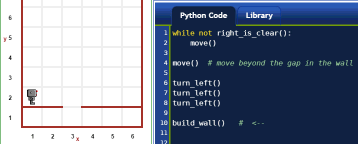

Basic commands
==============

.. topic:: Note for advanced readers

    Reeborg's World uses Python 3 syntax (thanks to Brython) and follows
    the PEP 8 naming convention (with some minor exceptions).

.. topic:: Note for complete beginners

   *We have a problem!*  As a complete beginner, if you don't know
   anything about Python (and programming), you might find the following
   descriptions confusing as I use Python syntax to illustrate how the basic
   commands work.  However, in order to explain the Python syntax, I need
   you to know what the basic commands do ...

   My suggestion:  read through this once, not spending
   too much time if you find something confusing.  Then read the next
   two sections, first the one about objects that you can find in
   Reeborg's World, followed by the other page,
   which gives you a quick introduction to Python, where I will
   once again make use of similar examples.  After having read
   through these pages, come back here ... and everything should
   make a lot more sense.

In this section, we focus on simple worlds and document
commands that Reeborg can follow.  Commands are Python functions.
In Python, a function named ``my_function`` is executed when
it is "called" by having its name followed by parentheses:
``my_function()``.

In this section, except for one example near the end,
we consider only functions with no arguments. [If you don't
know what an *argument* to a function is, we will
explain it below.]
There are two types that we will consider:

1. Simple actions that Reeborg can execute, like ``move()``

2. Information gathering that Reeborg can do, like ``front_is_clear()``
   which instructs Reeborg to determine if there are immediate
   obstacle in its path.

In the examples we show, we make use of some special Python keywords,
like ``while``, ``True``, and ``not`` which you may have not see yet.

Movement
--------

``move()``
***********

Reeborg's World is defined on a grid.  Reeborg's action take place
on a single grid location **or** Reeborg can move from one grid
location to another when told to ``move()``.

=================  =================
Before ``move()``   After ``move()``
-----------------  -----------------
|move_e_before|    |move_e_after|
|move_n_before|    |move_n_after|
|move_w_before|    |move_w_after|
|move_s_before|    |move_s_after|
=================  =================

.. |move_e_before| image:: ../images/move_e_before.png
.. |move_e_after| image:: ../images/move_e_after.png

.. |move_n_after| image:: ../images/move_n_after.png
.. |move_w_before| image:: ../images/move_w_before.png
.. |move_w_after| image:: ../images/move_w_after.png
.. |move_s_before| image:: ../images/move_s_before.png
.. |move_s_after| image:: ../images/move_s_after.png

A ``move()`` instruction can fail, and cause the program to come
to a halt if Reeborg's path is blocked.

``turn_left()``
***************

A ``turn_left()`` command instructs Reeborg to turn 90 degrees
to its left.  Such a command can never fail.

|turn_left|

Handling objects
----------------

.. important::

    In this section, we assume that the world in which Reeborg is
    has only one kind of object at a given time.

``take()``
************

A ``take()`` command instructs Reeborg to pick up an object
located at its position.  This command can fail if there
are no object at that location; it can also fail if there
are two different kinds of objects, since Reeborg would not
know which one to take.

``put()``
************

A ``put()`` command instructs Reeborg to put down an object
that it is carrying.  This command can fail if Reeborg
carries no object, or if Reeborg carries more than
one type of objects since it would have no way to know
which one to put down.

|take_put|

.. |take_put| image:: ../images/take_put.gif

Getting information about the world around
--------------------------------------------

Reeborg has limited senses which are nonetheless sufficient
to help him accomplish the required tasks.

``is_facing_north()``
**********************

Reeborg is able to determine whether or not it is facing
North (towards the top of the computer screen).

|is_facing_north|

.. |is_facing_north| image:: ../images/is_facing_north.gif

``at_goal()``
*************

Reeborg can determine if it has reached its final destination,
as indicated in the task.

|at_goal|

.. |at_goal| image:: ../images/at_goal.gif

``front_is_clear()``
********************

Reeborg is able to determine if there are immediate obstacles
(like a wall) in its path.  In the example shown immediately
below, we also use ``think()`` which is explained near the
end of this page.

|think|

``right_is_clear()``
********************

Reeborg is able to determine if there would be obstacles to
its right.  In the example below, Reeborg follows the
wall to its right until there is a gap (and ``right_is_clear()``
is true).  At that point, we ask Reeborg to fill the gap
in the wall using ``build_wall()`` explained near the
end of this page.

|build_wall|

``object_here()``
******************

Reeborg can determine whether or not there is at least one
object at his location.

``carries_object()``
**********************

Reeborg can determine whether or not it carries at least
one object.

In the example below, we use both ``object_here()`` and
``carries_object()`` to have Reeborg collect all objects
and put them all at one location.  Whenever there is
more than one object at a given location, a number appears
indicating how many objects are at that location.

|object_here|

.. |object_here| image:: ../images/object_here.gif

Interruptions
--------------

``pause()``
***********

Instructs Reeborg to pause the execution of the program
at that point and wait until someone clicks on either
the "run" button or the "step" button to resume.

``done()``
***********

Instructs Reeborg to ends its program, whether or not
all other lines of code have been executed.

In the example below, we use both ``pause()`` and ``done()``
to interrupt the normal execution of a program.

|pause|

.. |pause| image:: ../images/pause.gif

``think()``
***********

You may have noticed that Reeborg takes a bit of time
between each commands; that is because it must "think"
about what you are asking it to do.  However, one can
change the amount of time Reeborg takes to think by using
the ``think()`` function with an argument, like
this:

.. code-block:: python

    think(500)

The number ``500`` which appears between the parentheses
is what we call an *argument* of a function. The smaller
the number, the less time Reeborg will take before
considering each action.  A value of 1000 means that
Reeborg takes about 1 second to think.  I should note however
that Reeborg has something to think about certain things
that you are not aware of and may sometimes seem to think
for longer than you'd expect it to.

|think|

.. |think| image:: ../images/think.gif

Changing the world
------------------

``build_wall()``
****************

Reeborg can build walls, right it front of where it stands, as we
have seen before.  Note that this instruction can fail if
there is already a wall at that location.

|build_wall|

|build_wall_fail|

