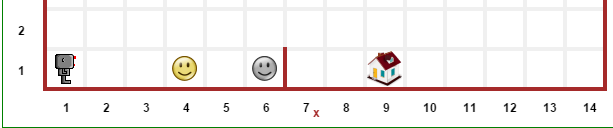

Information for educators
=========================

.. figure:: ../images/rurple_book.png

   *Two books (red for teacher, blue for students)
   produced by Samsung Korea based on RUR-PLE, the desktop
   program precursor to Reeborg's World.*

In the beginning ...
--------------------

R. Pattis created *Karel the robot* in 1981, to introduce some
basic concepts in programming to Stanford's students.  This approach
has been found to be simple enough that it could be used not only
with university-level students but with learners of all ages.

Reeborg's World has been created with the goal of simplifying Pattis's
idea as much as possible, while still making it possible to
introduce very advanced programming concepts.

The simplest valid program in Reeborg's World is::

    move()

That's it: a single instruction.  What could be simpler when
teaching beginners?

If one wants to use an OOP approach instead (starting with
an empty world), the simplest valid program is::

    reeborg = UsedRobot()
    reeborg.move()

Because using standard libraries is something useful, students
can first learn about libraries by writing their own code and, in doing so,
they learn that library modules are just programs like any others.
Assuming they have define a function, say ``turn_right()``, in their library,
the following program will be valid:

.. code-block:: python

    from library import turn_right
    turn_right()

So, the idea is to have the student deal with as few concepts as possible
to write programs, only learning new concepts (such as Object-Oriented notation
and importing code from a library) after they have learned the basics.

However, this simplicity does not limit what can be done.
The Python version of Reeborg's World is based on Brython_, and includes
many Python modules found in Python's standard library.

.. _Brython: http://brython.info

Here's an example that show a hint of the possibilities for
advanced tasks.

Load and execute the following single line program::

    Permalink("simple_demo1")

This will load up a world with a simple task to perform:

|simple_demo1|

Witht this world loaded, execute the following program::

    import json
    world_str = window.JSON.stringify(RUR.current_world, None, 2)
    print(world_str)

    # convert to a Python dict using Brython's json module
    # N.B. this module is not equivalent to the one found
    # in Python's standard library
    world_dict = json.loads(world_str)

World states are encoded as JSON objects. In this case, the content
of the world (converted to a Python dict) is as follows:

.. code-block:: json

    {
      "robots": [
        {
          "x": 1,
          "y": 1,
          "orientation": 0,
          "_prev_x": 1,
          "_prev_y": 1,
          "_prev_orientation": 0
        }
      ],
      "walls": {
        "6,1": [
          "east"
        ]
      },
      "description": "Simple task demo.",
      "small_tiles": false,
      "rows": 12,
      "cols": 14,
      "objects": {
        "4,1": {
          "token": 1
        }
      },
      "goal": {
        "objects": {
          "6,1": {
            "token": 1
          }
        },
        "possible_positions": [
          [
            9,
            1
          ]
        ],
        "position": {
          "image": "house",
          "x": 9,
          "y": 1
        }
      }
    }

Advanced students could, in principle,
use this information to explore advanced concepts,
similar to the ones found on the Berkeley_ site that uses PacMan to explore
topics in Artificial Intelligence.

.. _Berkeley: http://ai.berkeley.edu/project_overview.html

.. important:: Please help reduce bandwidth usage.

    If http://reeborg.ca/world_dev.html is loaded in your browser, you
    can update its contents in a number of ways explained below.

Reducing bandwidth
------------------

There are many features you can use to reduce bandwidth usage and have
Reeborg's world be more responsive.   I will document three here.

First method: World hosting
****************************

Assuming you have
http://reeborg.ca/world_dev.html already in a browser tab,  write the
following one-liner in the editor and run this program (twice).

.. code-block:: python

    World("gravel_path")

The first time the program is executed, the correct world is selected.
The second time the program is executed, this instruction is ignored
and the rest of the program (left up to you to write) is executed.

Once the world is loaded, you might want to click on the
"World info" button at the top, and then click anywhere on the world
and see some information about this world, including a description
of the task to accomplish.

A world using exactly the same logic, but with a radically different
appearance, can be loaded using

.. code-block:: python

    World("/test_worlds/no_gravel_path")

Notice how this world is located in a subdirectory.

.. topic::  Version française

    Si vous utilisez http://reeborg.ca/monde.html,
    les équivalents français de ``World`` et ``Permalink`` sont
    ``Monde`` et ``Permalien``.

I will host the worlds you create on my website so that they can
be easily loaded using the above method and reduce bandwidth usage.
Your worlds will be in your own subdirectory.
However, I do have a request: you must agree to give me permission
to make at least one of your worlds available to others
by listing it on the `World contributed by users <contributed.html>`_
page with proper attribution.

Ideally, I would like to get permission to list **all** the worlds
you create and that are hosted on my server.  If everyone does so,
teaching resources will grow and become more useful to everyone as
time goes on.

Second way: using hosted permalinks
***********************************

A second, similar way, is to use hosted permalinks.  For example,
you can try the following:

.. code-block:: python

    Permalink("test_permalink")

Permalinks can encode world state as well as editor and library
content - thus can be used to show a complete solution.  If you don't
have your own website, I will host your permalinks for you.
All I ask in exchange is to be able to make available to others
at least one of the worlds/challenges you have created.

Third way: hosting your own permalinks
**************************************

If you have your own website where you can put files,
and you have contributed at least one word to the public collection (!),
then you can host your own permalinks.
[Obviously, you can do this without telling me nor contributing a world.]
Here's an example of a permalink I have put on a different server:

.. code-block:: python

    Permalink("http://personnel.usainteanne.ca/aroberge/reeborg/test_sokoban1")

Other ways
**********

There are other ways of loading up worlds (e.g. loading a world from
a local file, copying/pasting the content of a permalink into the
permalink textarea and clicking on the "update" button, etc.), but the
above three are the recommended methods.

Not recommended: actual permalinks
***********************************

The ``Permalink()`` function has been named since its argument is
a "standard" permalink.  For example, clicking on this link_ will
take you to Reeborg's World, ready to execute a program.

There are two potential problems with this approach:

1. Each time the user clicks on such a link, the entire website is reloaded.

2. Long permalinks exceed the capacity of the server and result in an Internal
   Error.

.. _link: http://reeborg.ca/world_dev.html?proglang=python-en&world=%7B%0A%20%20%22robots%22%3A%20%5B%0A%20%20%20%20%7B%0A%20%20%20%20%20%20%22x%22%3A%201%2C%0A%20%20%20%20%20%20%22y%22%3A%201%2C%0A%20%20%20%20%20%20%22orientation%22%3A%200%2C%0A%20%20%20%20%20%20%22_prev_x%22%3A%201%2C%0A%20%20%20%20%20%20%22_prev_y%22%3A%201%2C%0A%20%20%20%20%20%20%22_prev_orientation%22%3A%200%0A%20%20%20%20%7D%0A%20%20%5D%2C%0A%20%20%22walls%22%3A%20%7B%7D%2C%0A%20%20%22description%22%3A%20%22A%20simple%2C%20empty%20world%2C%20ready%20for%20Reeborg%20to%20explore.%5Cn%3Cbr%3E--%3Cbr%3E%3Cem%3EUn%20simple%20monde%20vide%2C%20que%20Reeborg%20peut%20explorer%20%C3%A0%20sa%20guise.%3C%2Fem%3E%22%2C%0A%20%20%22small_tiles%22%3A%20false%2C%0A%20%20%22rows%22%3A%2012%2C%0A%20%20%22cols%22%3A%2014%0A%7D&editor=move()%0A&library=