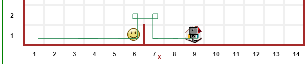
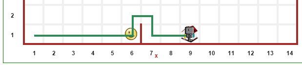

Advanced features
==================

Reeborg's World is designed to make it easy to set up
programming tasks that provide automated feedback to students.
However, sometimes some additional customization might be desired.
This section documents various possibilities, some of which
have already been mentioned elsewhere.

Simple task
------------

First, we consider a simple task.  Load the following::

    Permalink("simple_demo1")

The initial task to accomplish looks like:

|simple_demo1|

.. |simple_demo1| image:: ../images/simple_demo1.png

and the final result is as follows:

|simple_demo1f|

Different traces: style
------------------------

By default, Reeborg leaves a trace slightly "off-center", thus showing clearly a difference between a left turn and a right turn
(done by doing 3 left turns).  Perhaps you want to show the path taken by Reeborg, without giving any hint about
using 3 left turns to turn right, like this:

This can be done using the following code::

    set_trace_style("thick")

The result looks like the following:

|simple_demo2|

Alternatively, suppose you wish to show the robot accomplishing its task but without leaving a trace behind.
You can use "none" instead of "thick" to do this.
(The normal case would be "default" and is reset automatically.)

.. important::

    ``set_trace_style``, with the values of ``"thick"`` or ``"default"`` is a
    global function that affects the traces of all robots.  If it is called
    multiple times within a program, only its last invocation will have an effect.

    When a value of ``"none"`` is chosen, the trace is drawn with a completely
    transparent color which can be overriden.
    As shown below, robots can have traces of different colors.

Different traces: color
------------------------

Different robots can have different trace colors or can even change
the color of the trace left behind at any point within a program.
Load up::

    Permalink("simple_demo2")

to see an example of this.  Valid names color, to be used to
the argument of ``set_trace_color()`` include html named colors,
rgb values, and rgba values - the latter being useful to make a
trace temporarily invisible.

|simple_demo2b|

.. |simple_demo2b| image:: ../images/simple_demo2b.png

Different robot models
----------------------

By design, the choice of robot model is left to the user,
who can choose their robot model by clicking on a image
button at the top of the world.

|models|

.. |models| image:: ../images/models.png

All robots normally present will be of the same model.
However, when creating a robot, it is possible to assign
a specific model (integer from 0 to 3) using the following::

    reeborg = UsedRobot()
    reeborg.set_model(0)

This is also demonstrated in::

    Permalink("simple_demo2")

mentioned above.

Random worlds
--------------

It is possible to design worlds so that the initial position
of the robot is chosen randomly from specified choices; in
this case, a slighthly transparent image will initially appear
at all the possible locations.

Similarly, it is possible to assign a range of possible values
for the number of objects found at a given location.  If this is done,
it is possible to require to have all of the objects (total initial
number unknown) of a specific type to be put at a given location.
In these cases, a question mark initially appears next to the number of objects
when the world is drawn. The specific values at each run appear after the
first step of the program's execution.

Finally, it is possible to have the final position of the robot to be chosen
amongst a given set.

All of these are demonstrated in the example::

    Permalink("simple_demo3")

|simple_demo3|

.. |simple_demo3| image:: ../images/simple_demo3.png

Adding code to be run in addition to user's program
----------------------------------------------------

When editing the world, you can add a extra code that will be run
either before the user's program is run, or after it is run, or both.

.. warning::

   A word of caution: if you include *post* code and the user
   include the instruction ``done()`` in their program, the
   post code will never be reached when ``done()`` is executed.
   In this case, a good strategy is to redefine ``done()``
   in the **pre** code part, perhaps replacing it with
   something like this::

        def done():
            raise ReeborgError("You are not allowed to use 'done()'.")

|pre_post_code|

.. |pre_post_code| image:: ../images/pre_post_code.png

You can see a very simple example of this by selecting::

    Permalink("pre_post_demo")

and then run the resulting program, which simply
insert a print statement before and another one after the
program in the editor.  A **much** longer example,
illustrating the usage of ``narration()`` is::

    Permalink("story")

This program adds a "twist" to the story, simply
included for effect: make sure to let the program
run to the end.

Replacing the default robot
---------------------------

Suppose you want to use a robot that can has enhanced capabilities in
one of your examples while using an existing world.
For instance, suppose I want to show a solution to jumping over the
hurdle with a robot that can turn right directly, without doing three left turns.
One "obvious" way might be as follows:

1. Create a copy of the desired world.
2. Remove the robot
3. Save the world under a different name
   (if using the same browser to show the example) or a usb key
   (and load it in a different browser, if planning the work at home
   and using it in the classroom)
4. Write a program that first creates a robot with the desired attributes.

This approach would work ... except that the world initially shown will
not have any robot visible and would thus be different than what the
students would see when they would attempt to work on it with their robot.

There is a better way!

.. note::

   By using this code in the "pre" code, or in the library, we ensure that
   the line executed is not "highlighted" and have a frame with no robot
   present.

Either in the "pre" code, or in the library you can use the instruction::

   RUR.world.__remove_default_robot()

as the very first instruction in your program, and
then create an instance of your robot with the desired enhanced capabilities.
Since there will be only one robot in the world,
basic instruction like ``move()` or ``turn_left()``
will work on your robot as-is: by design,
they work with the first robot created without requiring the instance name.

Have a look at::

    Permalink("test_remove")

to see an example where a new robot, capable of turning right directly,
is defined in the library and replaces the default robot.
Something like this can be used to demonstrate the path taken by a robot
without giving

Enhanced goals
--------------

You know that you can set some "goals" for Reeborg to accomplish using the
graphical world editor.
When a world is designed to contain goals, at the end of the program's
execution, the state of the world is compared with that expected from the goals,
and a pop-up dialog is shown, indicating how each goal was met.

Reeborg's world includes a non-documented function called ``verify()` in the
English version, and ``confirmer()`` in the French version,
which can be used to perform some other tests.

For example, suppose we want the robot to end facing East.  This can
be done by adding::

    verify("orientation == East")

at the end (perhaps using the **post** code; however, remember to
redefine ``done()`` in this case).

In order for this utility function to be available in both
Javascript and Python, it has been written in Javascript.
As a result, not all Python code is possible.
As you know, in Python, chained comparisons such as::

    0 < x < 5

are possible; however, this is not the case in Javascript.
So, we would write instead:

.. code-block:: python

    0 < x and x < 5

If you know Javascript, you know that the logical ``and`` parameter
is ``&&`` ...
so you may wonder how we can use ``and``.
The reason (if you look at the code below) is that a simple
replacement is made, where ``and`` is replaced by ``&&`` so that
Python programs using ``verify()`` can be written in a more natural way.
Note that all Python logical operators
(``and``, ``or``, ``not``) should be
surrounded by spaces for the replacement to take place.

It should also be noted that some of these tests may not behave as
expected.  Whenever possible, it is likely better to use the following pattern::

    try:
        assert some_python_expression
    except AssertionError:
        raise ReeborgError("Some appropriate message")

You can try the example::

    Permalink("test_verify")

to see some such tests.

Actual code for ``verify()``
****************************

When this document was written, this was the definition of
``verify()``.

.. code-block:: javascript

    RUR.verify = function(test) {
        var reeborg, robots, world, orientation;
        var east, East, west, West, north, North, south, South;
        var js_test;
        east = East = RUR.EAST;
        west = West = RUR.WEST;
        north = North = RUR.NORTH;
        south = South = RUR.SOUTH;
        world = RUR.current_world;
        robots = world.robots;
        reeborg = robots[0];
        orientation = reeborg.orientation;

        // if language is Python ... require spaces around logical operators to simplify
        js_test = test.replace(/ and /g, '&&');
        js_test = js_test.replace(/ or /g, '||');
        js_test = js_test.replace(/ not /g, '!');
        // True and False should not necessary to use ... but just in case
        js_test = js_test.replace(/False/g, 'false');
        js_test = js_test.replace(/True/g, 'true');

        if (eval(js_test)){ // jshint ignore:line
            return;
        }
        throw ReeborgError("Failed:  "+test);
    };

Actual code for ``confirmer()``
********************************

.. code-block:: javascript

    RUR.confirmer = function(test) {
        var reeborg, robots, monde, orientation;
        var est, nord, sud, ouest;
        var js_test;
        est = RUR.EAST;
        ouest = RUR.WEST;
        nord = RUR.NORTH;
        sud = RUR.SOUTH;
        monde = RUR.current_world;
        robots = monde.robots;
        reeborg = robots[0];
        orientation = reeborg.orientation;

        // if language is Python ... require spaces around logical operators to simplify
        js_test = test.replace(/ and /g, '&&');
        js_test = js_test.replace(/ or /g, '||');
        js_test = js_test.replace(/ not /g, '!');
        // True and False should not necessary to use ... but just in case
        js_test = js_test.replace(/False/g, 'false');
        js_test = js_test.replace(/True/g, 'true');

        if (eval(js_test)){ // jshint ignore:line
            return;
        }
        throw ReeborgError("Échec :  "+test);
    };

Easy collaboration with TogetherJS
----------------------------------

From **Additional menu** at the top, you can find the button
"Collaboration": this activates Mozilla's TogetherJS which allows two, or
more, users to effectively interact on the same webpage.

Using Python's standard library
-------------------------------------------------

Brython comes with a significant portion of Python's standard
library.

Possibility to write programs using different languages
-------------------------------------------------------

Support for Python, Javascript and CoffeeScript.  Other languages
could be supported as well if they have a javascript transpiler.

Stepping back and forth through program execution
--------------------------------------------------

Programs are executed in two steps: first, the program is run
and a series of "frames", representing the complete state of
the world at that time, are recorded.  Second, these frames
are played back one at a time.

From the **Additional menu**, one has access to a "step back"
button which steps backwards, one frame at a time, instead of
forward.

An example of such use might be to run a program quickly,
by setting ``think(0)`` up to a "crucial" point at which
the program is paused using ``pause()``.  From that point on,
the program could be run either forward or backward, one frame at a time,
allowing to focus on one particular aspect being demonstrated.

Easy support for multiple human languages
-----------------------------------------

As mentioned elsewhere, it is fairly straightforward to
port Reeborg's World so that languages other than English
can be used.  Currently, only French is completely supported.
Thus, one can write::

    from reeborg_fr import *

    avance()           # equivalent to move()
    tourne_a_gauche()  # equivalent to turn_left()

However, French users should use http://reeborg.ca/monde.html
which has a French User Interface.

Possibility to integrate within a Learning Management System
------------------------------------------------------------

One teacher in Lithuania has made Reeborg's World accessible within Moodle
for students tasks that are then marked automatically.  Ideally, such use
should be made with local copies of Reeborg's World.

Changing the User Interface
---------------------------

If you know Javascript, html and css, and possibly how to use the jQuery library,
you can customize the look of Reeborg's World by running code
with a specially crafted permalink; the changes made will
remain until the site is reloaded.  For example,
if you run the program::

    Permalink("simple_ui")

almost every item menu from the top bar will be removed with
the exclusion of "Help" and "World info".  You simply have to run
the program::

    Permalink("normal_ui")

to recover the normal User Interface.

If you want to make your own changes, you might want to
open Reeborg's World into a separate tab and enable the javascript console.
Then, use Javascript/jQuery commands in the console to change the UI as desired.
Copy **all** of your required code (not forgetting semi-colons...) into the textarea below.

For example, suppose you wanted to hide the choice of programming
language selection; you could do so using the following jQuery code:

.. code-block:: javascript

    $("#header-child form").hide();

You can use the above as an example and copy it into the textarea below
and then click the "Create permalink code" button; the result will
appear below the button.  Note that you need to create all the UI
changes into a single conversion.  Once you have the result, copy it
and *append it* to a "normal" permalink created within Reeborg's
World; your new permalink, when used to update Reeborg's world,
will make the required changes to the UI.

.. raw:: html
   :file: css_mod.html

If you need help with making changes to the User Interface, please do not hesitate to contact me.

