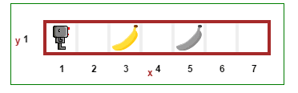

.. Reeborg's World documentation master file, created by
   sphinx-quickstart on Sun May 31 17:47:43 2015.
   You can adapt this file completely to your liking, but it should at least
   contain the root `toctree` directive.

Welcome to Reeborg's World's documentation!
===========================================

.. topic:: Please help reduce bandwidth usage.

    If http://reeborg.ca/world_dev.html is loaded in your browser, you
    can update its contents in a number of ways explained in the
    Information for teacher's section and elsewhere.

.. figure:: ../images/reeborg_judkis.jpg
   :figwidth: 35%
   :align: right

   This is a model of Reeborg made by a student in New Jersey (USA) who
   learned Python with RUR-PLE, an older version of Reeborg's World
   that has been available as a desktop program since 2004.

   *Photo courtesy of A. Judkis.*

Reeborg's World is an adaptation of Richard Pattis's *Karel the robot*.
It supports three programming languages (Python, Javascript and CoffeeScript).
However, the focus of this documentation is on Python which is my
favourite programming language and, I believe,
the ideal one to use for teaching programming concepts.

Reeborg's World is **free**: *free* to use, *free* to copy (and put on a school's
website), and does not require any registration or login.
Unlike some other existing code learning website, it does not force
learners to follow a pre-defined path; educators are *free* to create their
own learning material and make use of Reeborg's World.

.. note::

    I have one small request for educators: if you use Reeborg's World, please
    consider contact me and sharing **at least** one of your custom-designed
    worlds that I will include in this documentation
    so that others may be inspired by it.

Task Driven Learning
--------------------

Reeborg's World is designed for *Task Driven Learning*: students are given
tasks that Reeborg has to complete, and they must write programs instructing
Reeborg how to do so.

Tasks include having Reeborg move objects, build walls, or go to a
particular location.  Objects in Reeborg's World are colourful; the
places they be must moved to by Reeborg are indicated by having a
picture of the object in shades of grey.

|simple_task|

.. toctree::
   :maxdepth: 3
   :numbered:

   who
   tour
   students
   educators
   commands
   objects
   python1
   python2
   library
   exception
   advanced
   oop
   sokoban
   howto
   contributed
   translators
   artists
   developers
   weakness
   comparison
   canvas
   mazes