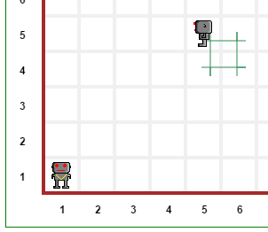

Putting it all together!
========================

You now know how to fix Reeborg. So, you have to do it.
**In your library**, define a new class of robots, using
the following outline as a model::

    class RepairedRobot(UsedRobot):

        def __init__(self, x=1, y=1, orientation='e', tokens=0, leaky=False):
            pass

        def turn_right(self):
            pass

        def turn_around(self):
            pass

        def is_facing_south(self):
            pass

        def is_facing_east(self):
            pass

        def is_facing_west(self):
            pass

        def face_south(self):
            pass

        def face_east(self):
            pass

        def face_north(self):
            pass

        def face_west(self):
            pass

        def left_is_clear(self):
            pass

Then, you can test your code by running the following
program which will make use of the code you wrote in your library.

.. code-block:: py3

    World("Empty")
    from test_repair import test

    test()

The result should look like the image below.
Pay close attention to the details of the trace left by the
oil leak and make sure your result looks identical.

|image0|

Congratulations!
----------------

I assume that you did manage to reproduce the image above.
If so, you have made much progress in understanding
Object-Oriented Programming using Python and are ready
to move on to another tutorial.