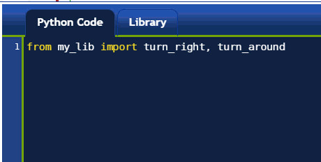

A quick Python introduction: part 3, Using the library
======================================================

When programmer make use of a given function in different programs,
rather than redefining it in each program they write, they put them in
special programs called **libraries** and they have a way to ensure that
their other programs can use the functions that are found in the
library.

You are likely going to use the function ``turn_right()`` **a lot!** Instead of
rewriting it each time, I suggest that you will click on the **library** tab and
write it there. Oh, and you should also write ``turn_around()`` there as
well.

Then, when you want to use the functions defined in your library, you will
simply type ``from library import`` (followed by the function names, separated
by commas) on its own line in the Python Code editor.  ``library`` is the name
that *I* have chosen to represent the code that is in the library tab.
As you will see elsewhere, Python comes with other libraries containing
code that you can use.

|library|

From that point on, you can use ``turn_right()`` and ``turn_around()``
as though you had defined them in the Python Code editor.

Other notation: ``import`` without ``from``
-------------------------------------------

Instead of importing specific functions, you can simply import the
name of the library::

    import library

Then, if you want to use a function from the library, you need to add
``library.`` in front of its name as in::

    library.turn_right()

This is useful if you are using multiple libraries that may have
some functions having the same name (but different meaning): by
adding the name of the library in front of the function, you know
exactly which one is being called.

Keyword ``as``
--------------

Occasionally, you might find it useful to use a different name
for a function - either because the original name is too long,
or because you already have a different function with the same name.
In those instances, you can use the keyword ``as``::

    from library import turn_right as right

    right()        # use it
    turn_right()   # not defined!!!!

Importing everything
---------------------

Very occasionally, you will find it convenient to use another Python library
that contains so many functions that it is very tedious (and difficult to
remember) to write the all when doing::

    from python_library import function1, function2, function3, ...

and you don't want to use ``python_library.`` in front of every single function.
In those instances, you can use the following syntax::

    from python_library import *

The ``*`` is a shortcut meaning "everything".  As a concrete example, you
can try::

    from reeborg_fr import *

If you try the above, it will import a French version of all the
commands that Reeborg knows.  Thus, you could write either the English
``move()`` or the French ``avance()`` and Reeborg will move forward.
