Objects, background images, etc.
================================

In addition to walls, which can block Reeborg's path, there are a number
of images that are used to represent various objects.

Basic objects
-------------

Reeborg can interact with various objects.  He can ``take()``
and ``put()`` down the following such objects, in particular,
|token| **token**, Reeborg's favourite object.  Tokens are like coins, except
most people find them of little value, especially with the smiling face
image; Reeborg begs to differ.

If there are more than one
object present, and Reeborg needs to specify which object to ``take()`` or
``put()`` down, Reeborg uses the name of the object as a string of character,
as in ``put("token")``  or ``take('token')``  [both single and double quotes
can be used, as long as they occur in pairs.]

In addition to tokens, Reeborg can interact with various geometrical
shapes, fruits, flowers, vegetables, etc.  [Many of these images
have been adapted from http://openclipart.com]

:apple: |apple|
:banana: |banana|
:carrot: |carrot|
:daisy: |daisy|
:dandelion: |dandelion|  While they can be pretty, dandelions are
  usually considered to be weeds - and often need to be removed from the world.
:leaf: |leaf|  Reeborg doesn't particularly likes leaves.
  The presence of a leaf (or more) in Reeborg's World usually
  indicates that Fall has arrived, the leaves are falling from the trees,
  and Reeborg must rake them instead of playing.  Given the opportunity,
  Reeborg always prefer to play.
:orange: |orange|
:strawberry: |strawberry|
:tulip: |tulip|
:square: |square|
:star: |star|
:triangle: |triangle|  A triangle of this kind could only exist inside
  Reeborg's World.  Here's a close-up view of this triangle.

|impossible-triangle|

Decorative objets
-----------------

The objects above can also be drawn purely as decorative objects.
When this is done, Reeborg cannot interact with them, and they are not
taken into account when deciding if a task has been accomplished or not.

Whereas the number of "normal" objects found at a given location is indicated,
no number is drawn for decorative objects.

Background tiles
----------------

:grass: |grass| |pale_grass| Harmless for Reeborg to walk on.
:gravel: |gravel|  Harmless for Reeborg to walk on.
:water: |water| Can cause Reeborg to drown.  Fortunately, Reeborg can
  detect it using ``front_is_clear()``.
:mud: |mud| Can cause Reeborg to get hopelessly stuck.  Reeborg cannot
  detect mud before stepping into it.
:brick wall: |bricks|  Reeborg can crash into this; fortuntaly, it can
    detect it using ``front_is_clear()``.
:ice: |ice| Causes Reeborg to slip and continue it movement towards the next
  tile.  This could be problematic if an obstacle lies there.  Reeborg cannot
  detect ice before stepping into it.

|slip|

Background image
----------------

It is possible to specify a single image to be used as background for the
entire world. This is done by providing an address (URL) where the image
file can be found.

When editing a world, the wall grid is drawn above that image so that it
is visible; in execution mode, this grid is drawn behind.  However, "real"
walls are drawn above the background image and are thus visible.

The background image is drawn as-is: its size is not ajusted in any way
(except when small tiles are used).  To figure out the size of the image
required, one simply has to count the number of grid squares: each square
is 40 by 40 pixels.

Special objects
---------------

Special objects, like normal objects, are drawn above background tiles.
However, they can not be picked up by Reeborg and they can change the
expected behaviour of a tile.

:bridge: |bridge|  Allows Reeborg to cross safely over water.  Reeborg will
  always express its happiness at being able to cross over a bridge instead
  of falling in water.
:fences:  |fence_right| - |fence_left| - |fence_double| - |fence_vertical|
  Can be detected by Reeborg.  If Reeborg is asked to move where a fence is
  located, Reeborg will attempt to jump over it but will fail miserably.
  Note that to make enclosed areas, you might have to overlap the image of the
  last one over one of the other three images.
:box: |box| Boxes are pushed out of the way by Reeborg ... provided something
  else, like a wall or another box, etc., is not preventing the box to move.
  A box pushed by Reeborg in the water will float and become a bridge allowing
  Reeborg to safely cross over water.  The example below illustrates this

|box-blocked|

Goals
-----

Reeborg, must accomplish certain goals, like reaching a final position,
or dropping certain objects at a certain location.
To indicate that one (or more) object must be dropped at a given
position, these grey images are used:

|apple_goal| |banana_goal| |carrot_goal|
|daisy_goal| |dandelion_goal| |leaf_goal| |orange_goal|
|strawberry_goal| |tulip_goal| |square_goal| |star_goal|
|triangle_goal| |token_goal|

To indicate that Reeborg must end its task at a given final position,
one of these images is used:

|green_home_tile| |house| |racing_flag|

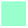
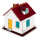
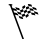

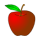
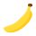
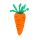
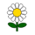

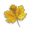
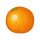
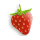
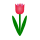

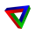
.. |impossible-triangle| image:: ../../images/impossible-triangle.png
.. |token| image:: ../../../src/images/token.png

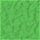
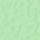
.. |gravel| image:: ../../../src/images/gravel.png
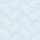

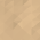
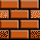
.. |slip| image:: ../../images/ice_slip.gif

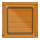
.. |box| image:: ../../../src/images/box.png
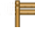
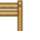
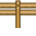
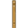
.. |box-blocked| image:: ../../images/box_blocked.gif

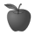
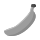
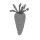
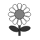

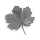
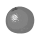
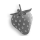
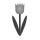
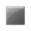

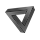

