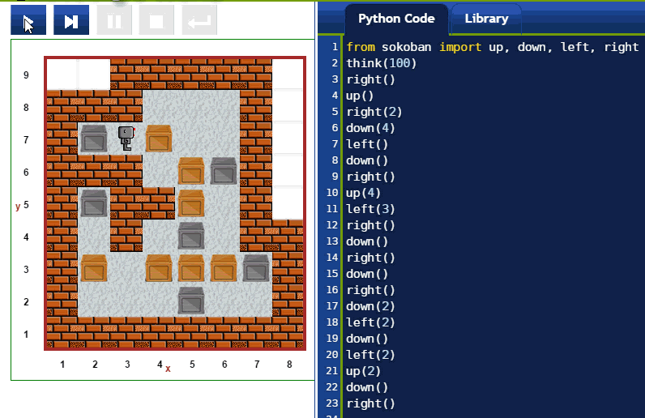

Sokoban
=======

.. figure:: ../../images/sokoban_ani.gif
   :figwidth: 55%
   :align: left

   "Sokoban ani" by Carloseow at English Wikipedia.
   Licensed under CC BY 3.0 via Wikimedia Commons -
   http://en.wikipedia.org/wiki/Sokoban#/media/File:Sokoban_ani.gif

From http://en.wikipedia.org/wiki/Sokoban

*The game is played on a board of squares, where each square is a floor or a wall.
Some floor squares contain boxes, and some floor squares are marked as storage locations.
The player is confined to the board, and may move horizontally or
vertically onto empty squares (never through walls or boxes).
The player can also move into a box, which pushes it into the square beyond.
Boxes may not be pushed into other boxes or walls, and they cannot be pulled.
The puzzle is solved when all boxes are at storage locations.*

Sokoban and Reeborg's World
----------------------------

Reeborg's World allows to solve Sokoban-like puzzles. However,
instead of using the arrow keys to control Reeborg, one uses
code telling Reeborg what to do.  However, just like the
original Sokoban, boxes may not be pushed into other boxes or
walls.  Unlike the original Sokoban, attempting to do so will
make Reeborg complain and stop its program.

|sokoban_wiki|

You can solve sokoban puzzles using only ``move()`` and ``turn_left()`` ...
but that would be extremely tedious.  Furthermore, Reeborg's oil leak would
make a mess of things.  It is much better to import the functions
``up()``, ``down()``, ``left()``, and ``right()`` from the sokodan library
and use them: they behave like you would expect arrow keys would behave.
Furthermore, these functions take an integer as an optional argument,
indicating how many times you want this function to be repeated: this allow
to write much shorter programs.

Finally, when importing the sokodan library, Reeborg's oil leak is automatically
stopped.

More challenges
---------------

Because boxes can be turned into bridges for Reeborg when they are
pushed in water, different types of challenges can be made, which
would be impossible to create with the original Sokoban.

|sokoban2|

.. |sokoban2| image:: ../../images/sokoban2.gif

Finally, one can think of adding **ice** tiles to make things a bit more
slippery and challenging.

Why sokoban?
------------

Sokoban type problems are logic problems which can be challenging to solve.
From my own experimentation, they seem more difficult to solve using
code than using traditional environment where arrow keys can be used to
control the character. [**Note to self**: *implement special mode with arrow
key control and recording mode.*]

They can be of interest to complete beginners, who have not learned yet
of control flow structures (``if/elif/else/while/...``) but want
to program a robot to do a difficult task.

Once a sokoban has been solved using the special sokoban functions
``up(), down(), left(), right()``, students may be asked to transform
this solution so as to make use only of ``move()`` and ``turn_left()``.

Sokoban for advanced students
-----------------------------

.. Topic:: For experts only

   **The following will not make sense, unless you are an
   advanced programmer.**

    Sokoban puzzles can be solved using search techniques taught to
    advanced students.  In order to be able to use such techniques,
    information about the world must be obtained by a program directly.
    Worlds are actually encoded as javascript object (only properties,
    no methods) which can be converted from json strings into Python
    dicts.  If you run the following program, you will be able to see
    how whatever world is loaded is represented and how to transform
    its representation into a Python dict.

    .. code-block:: python

        import json  # very incomplete Brython module
        from browser import window

        # First, use the builtin JSON Javascript function as it can
        # show a nicely formatted representation of the world;
        # this should have been implemented in the Brython json module
        # but is currently missing.
        world_str = window.JSON.stringify(RUR.current_world, None, 2);
        print(world_str)

        # Convert the json world representation into a Python dict
        # using Brython's json module.
        world_dict = json.loads(world_str)

        # We can now use Python's standard notation for dicts and lists
        # to extract the required information.
        print(world_dict["robots"][0]["orientation"] == RUR.EAST)

