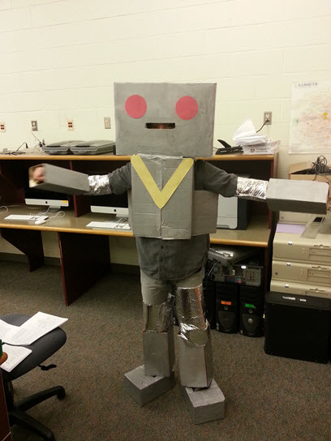

Who is Reeborg?
================

   Life-size Reeborg in New Jersey, USA.

   *Photo courtesy of A. Judkis.*

Reeborg is a programmable robot; not a modern high quality robot, but a rather
old one, put together rather quickly. **You** are going to be a good
programmer, unlike the maker of Reeborg, who wrote created a faulty robot.

#. Reeborg has an oil leak. Oil leaks are damaging for the environment
   and inconvenient for Reeborg who must replenish its supplies when
   it's not busy accomplishing tasks. The maker of Reeborg claims that
   it is a feature, as it enables you to follow Reeborg's path, just
   like any programmer can learn to "trace" a program. There are ways
   to fix Reeborg's leak ... hopefully you will learn how to do so.
#. Reeborg's steering mechanism is not handled properly by Reeborg's
   program: it can only turn left. The maker of Reeborg, once again,
   claims that this is a feature as it present you with an opportunity
   to learn about functions. Reeborg disagrees. Indeed, by defining a simple
   Python fuction, it is possible
   to program a *workaround solution*, enabling Reeborg to turn right,
   although in a wasteful fashion.  Using more advanced Object-Oriented
   techniques, it is possible to fix this flaw properly, once and for all.
#. Reeborg has a compass, enabling him to determine which direction he
   is facing. Unfortunately, yet again, the program that enables Reeborg
   to get the information from the compass has a bug: it only tells
   Reeborg if he is facing North ... or not. Once again, you can
   learn how to implement a workaround solution and later how to fix
   permanently Reeborg and get rid of what its maker calls a "feature".
#. Reeborg can see if a wall is in front of him, and can also turn its
   head to the right to see if there is a wall there. However, a
   software "glitch" (which is another weasel term that software
   manufacturers use to avoid having to say that their product has a
   bug) prevents Reeborg's program from properly registering a wall when
   it turns its head left.

Sometimes to find the cause of bugs, it can help to break the normal
flow of the program. To this end you may do one or more of the
following:

#. You can *pause* a program as it is running by pressing the **pause**
   button.
#. Instead of actually pressing the pause button, you can type in the
   instruction ``pause()`` at any point inside a program and Reeborg
   will pause, awaiting your permission to continue.
   This is similar to what people refer to as
   setting a *breakpoint* in a computer program when using a "debugger".
#. You can *step through* a program, one instruction at a time, by
   pressing the *execute one instruction and pause*, or **step** button.
#. You can change the speed of execution at any point inside a program by
   instructing Reeborg to take a certain amount of time to ``think()``.
#. You can have Reeborg write some information at any given point inside
   a program using Python's ``print()`` function.
#. If you click on "World info" at the top, and then click on Reeborg's
   World, you can find out some information about the state of the world,
   including whether or not Reeborg carries any objects.
#. Finally, you can stop a program at any point by pressing the **stop**
   button; this unfortunately may not work if you create
   what is known as an infinite loop, outside of Reeborg's control. If
   worse comes to worst, you can always just reload the web page.

