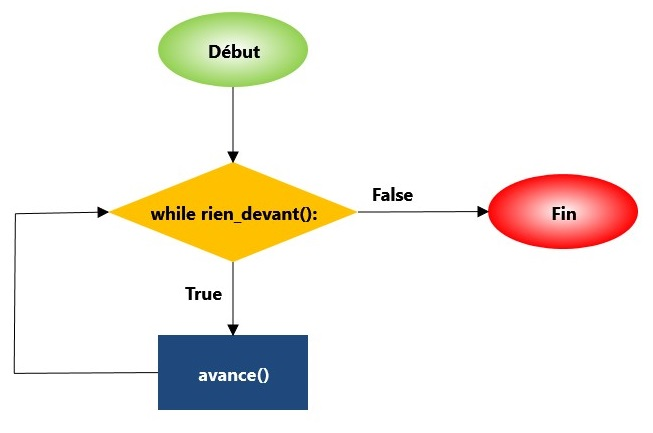

Tant que ...
============

Lorsqu'on veut répéter un bloc de code jusqu'à ce qu'une certaine
condition soit satisfaite, on peut utiliser le mot-clé ``while``, mot
anglais que l'on peut traduire par **tant que**. Par exemple, supposons
que l'on veuille que Reeborg se déplace en ligne droite jusqu'à ce qu'il
rencontre un mur. On pourrait écrire quelque chose comme::

    def avance_au_mur():
        if rien_devant():
            avance()

    repeat 42:
        avance_au_mur()

en se croisant les doigts et espérant que 42 sera un nombre suffisant de
répétitions pour atteindre le mur. Si on utilise plutôt le mot-clé
``while``, qu'on peut traduire par "tant que", on peut écrire::

    while rien_devant():
        avance()

C'est tout! Plus de devinettes sur le nombre de répétitions à faire.

Voici un organigramme illustrant ce simple programme:

Comment penser à ``while``
--------------------------

Supposons que l'on ait le code suivant::

    while condition():
        instruction_1()
        instruction_2()
        instruction_3()

Vous pouvez pensez ceci comme étant équivalent à::

    if condition():
        instruction_1()
        instruction_2()
        instruction_3()

    if condition():
        instruction_1()
        instruction_2()
        instruction_3()

    if condition():
        instruction_1()
        instruction_2()
        instruction_3()

    if condition():
        instruction_1()
        instruction_2()
        instruction_3()

    ...

c'est-à-dire que le bloc de code est répété aussi souvent que la
condition soit satisfaite (``True``). Qu'arrive-t-il si la condition est
toujours satisfaite? Le bloc de code est répété éternellement et le
programme ne termine jamais.

Ceci n'est pas une bonne chose.

Plutôt que d'utiliser la description de blocs de code répétés, les
programmeurs décrivent ceci comme une **boucle**: en commençant par la
première instruction, (``instruction_1()``) à l'intérieur du bloc de
code, on continue à exécuter les autres jusqu'à atteindre la dernière
(``instruction_3()``), puis le programme complète la boucle et retourne
tout juste avant le début du bloc de code où la condition est de nouveau
évaluée; si elle est satisfaite, la boucle se repete. Si la condition
est toujours satisfaite, on repete ad vitam æternam et on a alors une
**boucle infinie**.

Conclusion: vous voulez vous assurez que la condition ne sera pas
satisfaite (devenant équivalente à ``False``) à quelque temps.

De retour aux haies!
--------------------

.. topic:: À votre tour !

    Retournez aux courses **Haies 1**, **Haies 2** et **Haies 3**, et écrivez un seul
    programme pour ces trois courses en utilisant ``while``.

.. hint::

    Votre programme pourra ressembler à ceci::

        def saute():
            # instructions ...

        def cours_ou_saute():
            # instructions

        while not au_but():
            cours_ou_saute()

C'est tout! Plus besoin d'un nombre arbitraire de répétitions. À partir
de maintenant, n'utilisez plus ``repeat`` **sauf** si vous savez
**exactement** le nombre de fois qu'une certaine fonction doit être
répétée.

