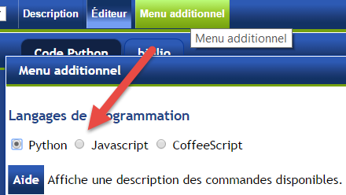

Javascript
==========

Convertir des programmes **simples** du langage Python au langage Javascript,
ou vice-versa, peut souvent être fait facilement.  Ci-dessous,
vous trouverez deux programmes équivalents; j'ai rajouté des lignes vides
dans la version Python pour que les deux programmes soient mieux alignés.

.. list-table::

   * - .. code-block:: py3

            ''' Solution au monde Autour 4 en Python:
                un simple programme.'''

            def tourne_a_droite():
                for _ in range(3):
                    tourne_a_gauche()

            def marque_point_depart_et_avance():
                depose("jeton")
                while not rien_devant():
                    tourne_a_gauche()
                avance()

            def suit_le_mur_a_droite():
                if rien_a_droite():
                    tourne_a_droite()
                    avance()
                elif rien_devant():
                    avance()
                else:
                    tourne_a_gauche()

            #  Exécution ci-dessous

            marque_point_depart_et_avance()

            while not au_but():
                suit_le_mur_a_droite()

     - .. code-block:: javascript

            /* Solution au monde Autour 4 en Javascript:
               un simple programme.            */

            function tourne_a_droite() {
                for (var i=1; i <=3; i++) {
                    tourne_a_gauche();
                }
            }

            function marque_point_depart_et_avance() {
                depose("jeton");
                while (!rien_devant()) {
                    tourne_a_gauche();
                }
                avance();
            }

            function suit_le_mur_a_droite(){
                if (rien_a_droite()){
                    tourne_a_droite();
                    avance();
                } else if (rien_devant()) {
                    avance();
                } else {
                    tourne_a_gauche();
                }

            // Exécution ci-dessous

            marque_point_depart_et_avance();

            while (!au_but()){
                suit_le_mur_a_droite();
            }

Pour convertir des programmes simples de Python à Javascript, on peut
suivre le guide suivant.

- Remplacer le mot-clé ``def`` par ``function``.
- Remplacer les deux points ``:`` qui indiquent le début d'un bloc par ``{``.
- Ajouter ``}`` à la fin d'un bloc de code.
- Entourer les conditions dans les énoncés ``if`` et ``while`` par des parenthèses ``(...)``.
- Ajouter des points-virgules ``;`` à la fin de chaque énoncé.
- Remplacer le mot-clé ``not`` par le symbole ``!``.
- Remplacer le mot-clé ``and`` par les symboles ``&&``.
- Remplacer le mot-clé ``or``  par le symboles ``||``.
- Remplacer les mot-clés ``True`` et ``False``  par ``true`` et ``false``.
- Remplacer le mot-clé ``elif`` par ``else if``.
- Replace le symbole de commentaires en bout de ligne ``#`` par ``//``
- Replace les trois apostrophes qui entourent un commentaire ``''' ... '''`` par ``/* ... */``.

Une chose que je n'ai pas indiquée est la correspondance entre les boucles ``for``
pour chaque langage.

.. topic:: Qu'en pensez-vous?

  Avec tous les symboles supplémentaires qu'il utilise, ne trouvez-vous pas que
  Javascript est plus compliqué à lire - et donc que Python est un meilleur choix
  pour apprendre la programmation?

Exploration Javascript
----------------------

Vous devez vous rappeler du programme Python suivant::

    reeborg = RobotUsage()
    for attr in dir(reeborg):
        if not attr.startswith("__"):
            print(attr)

Vous allez écrire un programme équivalent en utilisant Javascript.

En haut du Monde de Reeborg, cliquez sur le bouton "Menu additionnel"
puis choisissez Javascript (au lieu de Python qui est sélectionné
par défaut).

Javascript n'a pas de fonction comme ``dir()`` qui liste les attributs d'un
objet; de plus, la fonction ``print()`` est utilisée pour imprimer un document
sur du papier en utilisant une imprimante branchée à un ordinateur ...
ce qui ne serait pas souhaité ici.   Le monde de Reeborg utilise à la
place une fonction appelée ``examine()`` qui permet d'examiner les attributs
d'un objet.  Exécutez le programme suivant pour voir ce que ça donne:

.. code-block:: javascript

    var reeborg = new RobotUsage();
    examine(reeborg);

Voici ce que je vois quand je fais ceci::

    body
    au_but()
    construit_un_mur()
    rien_devant()
    mur_devant()
    carries_object()
    face_au_nord()
    avance()
    depose()
    rien_a_droite()
    mur_a_droite()
    objet_ici()
    prend()
    tourne_a_gauche()

Rien avec des doubles caractères de soulignement; on retrouve
``body`` et plusieurs autres méthodes (avec les parenthèses) que
l'on reconnait.  On est bien parti!

.. topic:: Droit au code!

   On a vu qu'il fallait rajouter une instruction ``sauteur.tourne_a_gauche()``
   pour voir le résultat du changement de coordonnées ``x`` et ``y``.
   Toujours avec Javascript, exécutez le programme suivant.

   .. code-block:: javascript

        var reeborg = new RobotUsage();
        voir_source(reeborg.tourne_a_gauche);

   Assurez-vous d'écrire le programme exactement comme je l'ai
   fait ci-dessus.  Notez que j'ai utilisé
   ``voir_source`` au lieu de ``examine``; ces deux fonctions
   sont des fonctions unique au Monde de Reeborg.

Lorsque j'exécute le programme ci-dessus, voici ce que **je** vois:

.. code-block:: javascript

   function () {
           RUR.control.turn_left(this.body);
       }

C'est une fonction dont le seul but semble être d'invoquer
la méthode ``RUR.control.turn_left``.
Ceci me suggère d'explorer la source de cette méthode comme suit.

.. code-block:: javascript

    var reeborg = new RobotUsage();
    voir_source(RUR.control.turn_left);

Et voici le résultat au moment où j'exécute le programme:

.. code-block:: javascript
   :emphasize-lines: 10

   function (robot){
       "use strict";
       robot._prev_orientation = robot.orientation;
       robot._prev_x = robot.x;
       robot._prev_y = robot.y;
       robot.orientation += 1;  // could have used "++" instead of "+= 1"
       robot.orientation %= 4;
       RUR.control.sound_id = "#turn-sound";
       RUR.rec.record_frame();
   }

Voici ce en quoi ressemblerait le code Python équivalent:

.. code-block:: py3
   :emphasize-lines: 8

    def _ (robot):
        robot._prev_orientation = robot.orientation
        robot._prev_x = robot.x
        robot._prev_y = robot.y
        robot.orientation += 1
        robot.orientation %= 4
        RUR.control.sound_id = "#turn-sound"
        RUR.rec.record_frame()

Nous reviendrons aux détails de cette fonction prochainement.  Pour l'instant,
j'attire votre attention sur la ligne surlignée en jaune pâle::

        RUR.rec.record_frame()

C'est cette fonction qui fait un enregistrement ("record" en anglais
signifie "enregistrer").  C'est le temps de faire de petits tests pour
vérifier ceci.

.. topic:: Faites ceci!

    Avec le monde **Vide**, exécutez le programme suivant::

      pas_de_surlignement()
      class Teleporteur(RobotUsage):

          def teleport(self, x, y):
              self.body.x = x
              self.body.y = y
              RUR.rec.record_frame()

      scotty = Teleporteur()
      scotty.teleport(4, 5)
      scotty.teleport(6, 3)

    Je note que la trace d'huile ne correspond pas au déplacement attendu...
    on verra sous peu pourquoi.

.. topic:: À votre tour!

   Créez une class qui peut "sauter" horizontalement, changeant la
   valeur de la coordonnée ``x`` lorsque la méthode ``saute`` est
   invoquée.  Puis, créez une instance de votre nouvelle classe
   et faites assurez-vous que le programme ci-dessous fonctionne
   pour les mondes **Haies 1** à **Haies 4**.  Notez que la
   fonction ``disparait()`` fait disparaître le robot qui était
   là au début.   Tout ce qu'il vous suffit de faire est de remplacer
   la ligne ``pass`` par deux lignes de code: une pour que le robot
   se déplace, et l'autre pour enregistrer l'état du  monde.

   .. code-block:: py3

      disparait()
      pas_de_surlignement()

      class Sauteur(RobotUsage):

          def saute(self):
              pass

      reeborg = Sauteur()
      while not au_but():
          reeborg.saute()

.. hint::

   Vous pouvez faire avancer le robot en utilisant la méthode d'incrémenter
   une variable::

       self.body.x += 1

