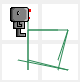
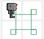
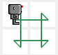

L'opérateur modulo
==================

Faisons un bref retour en arrière.  Lorsque j'ai écrit et exécuté
le programme suivant:

.. code-block:: javascript

   var reeborg = new RobotUsage();
   voir_source(RUR.control.turn_left);

J'ai vu ce qui suit (et vous avez vous aussi dû voir quelque
chose de semblable):

.. code-block:: javascript
   :emphasize-lines: 7

   function (robot){
       "use strict";
       robot._prev_orientation = robot.orientation;
       robot._prev_x = robot.x;
       robot._prev_y = robot.y;
       robot.orientation += 1;  // could have used "++" instead of "+= 1"
       robot.orientation %= 4;
       RUR.control.sound_id = "#turn-sound";
       RUR.rec.record_frame();
   }

.. note::

   Le symbole ``%`` a une autre signification en Python lorsqu'il est
   utilisé pour des chaînes de caractères.

Remarquez la ligne surlignée en jaune avec le symbole ``%``;
ce symbole représente l'**opérateur modulo** en Python et en Javascript.
Avant de poursuivre mon explication, je vous demande de sélectionner
Python comme langage de programmation et d'exécuter le programme suivant:

.. code-block:: py3

    for i in range(10):
        print(i, i % 4)

Vous devriez voir deux colonnes de chiffres.
Dans la colonne de gauche, les chiffres augmente de 0 à 9.
Dans la colonne de droite, les chiffres augmentent jusqu'à 3, puis
recommence à augmenter à partir de zéro.

L'opérateur modulo calcule le **reste** de la division entière (division
d'un chiffre entier par un autre).  Rappelez-vous lorsque vous
avez appris au sujet de la division des nombres.  En premier, on vous
a probablement dit qu'on ne pouvait pas diviser 7 par 4.
Plus tard, on vous a probablement appris que la division de 7 par 4
donnait 1 avec **un reste de 3**.   Plus tard encore, vous avez appris
que 7 divisé par 4 donnait 1 et trois quarts, puis 1,75 ....

Donc, l'opérateur modulo calcule le reste de la division par un entier.
Dans le code Javascript ci-dessous, l'opérateur modulo est utilisé
pour faire en sorte que la valeur de ``robot.orientation`` soit toujours
un chiffre entier entre 0 et 3; pour faire un virage à gauche, on augmente
sa valeur par 1 puis on calcule le reste de la division par 4.
Puisqu'un virage à droite est équivalent à un virage à gauche, ceci suggère
qu'on augmente la valeur par 3, puis qu'on calcule le reste de la division
par 4.   Essayons donc de faire ceci.

.. topic:: Essayez!

   Exécutez le programme suivant pour voir si ça fonctionne correctement::

        class RobotRéparé(RobotUsage):
            def tourne_a_droite(self):
                self.body.orientation += 3
                self.body.orientation %= 4
                RUR.rec.record_frame()

        reeborg = RobotRéparé(3, 3)  # loin des murs
        for i in range(4):
            reeborg.avance()
            reeborg.tourne_a_droite()

Vous pourrez constater que Reeborg tourne à droite directement, sans faire
3 virages à gauche!   Il n'y a qu'un seul petit problème esthétique ...

Fuite d'huile
--------------

Vous avez probablement remarqué que la "fuite d'huile" a une apparence
bizarre, avec des lignes en diagonale.

Bien que l'on veuille réparer
Reeborg pour qu'il n'ait plus de fuite d'huile, ce serait bien si, en attendant,
on pouvait faire en sorte que la fuite d'huile ait une meilleure apparence.

Normalement, lorsque Reeborg se déplace en ligne droite, ou qu'il tourne vers
sa gauche, la fuite d'huile est un simple segment de droit tracé horizontalement
ou verticalement, entre sa position précédente et sa nouvelle position.
S'il tourne, on a un tout petit segment de droit qui dépend de son orientation
précédente et de sa nouvelle orientation.

À cet effet, on remarque
les variables suivantes dans la fonction Javascript obtenue au
début de cette section:

.. code-block:: javascript

       robot._prev_orientation
       robot._prev_x
       robot._prev_y

Tel qu'on l'a mentionné plus tôt, l'abbréviation "prev" et pour le mot
anglais "previous" voulant dire "précédent".  On va donc faire comme ceci:

- Avant d'amorcer un virage à droite, on va noter la position et l'orientation
  et associer les variables "précédentes" à ces valeurs.
- Puisque le tracé d'un virage à gauche est bien fait, on va changer
  la valeur de l'orientation "précédente" pour correspondre à celle qu'on
  aurait eu si on avait fait deux virages à gauche.
- On va faire ensuite un virage à droite, équivalent à trois virages à gauche,
  donc un de plus que la nouvelle valeur "précédente".

Voici le code correspondant::

    class RobotRéparé(RobotUsage):
        def tourne_a_droite(self):

            # Les valeurs avant le virage sont notées comme étant
            # les valeurs précédant le virage à droite
            self.body._prev_orientation = self.body.orientation
            self.body._prev_x = self.body.x
            self.body._prev_y = self.body.y

            # on simule deux virages à gauche pour l'orientation "précédente"
            self.body._prev_orientation += 2
            self.body._prev_orientation %= 4

            # on fait un virage à droite
            self.body.orientation += 3
            self.body.orientation %= 4

            # on enregistre le résultat
            RUR.rec.record_frame()

    reeborg = RobotRéparé(3, 3)  # loin des murs
    for i in range(4):
        reeborg.avance()
        reeborg.tourne_a_droite()

.. topic:: À votre tour!

   Exécutez le programme ci-dessus, et assurez-vous de bien comprendre
   ce que chaque ligne signifie.

Si vous avez exécuté le programme ci-dessus avec le surlignement de code
activé, vous devez avoir obtenu le résultat suivant:

Je rappelle qu'un des effets du surlignement de code pendant l'exécution est
d'insérer des images supplémentaires correspondant à l'état du monde
à ces étapes.

Si vous avez exécuté le programme ci-dessus avec le surlignement de
code **désactivé**, vous devez avoir obtenu le résultat suivant:

.. image:: ../../../src/images/turn_right3.png

C'est ce dernier résultat qui est souhaité.  Si vous voulez voir ce
résultat tout en gardant le surlignement de code, il est possible de
le faire en écrivant la définition de la nouvelle classe dans votre
bibliothèque puis en utilisant

.. code-block:: py3

    from biblio import RobotRéparé

dans votre programme.  Les instructions supplémentaires, pour montrer
le surlignement de code dans **l'éditeur** n'ont aucun effet sur
le code **dans la bibliothèque**.

.. topic:: À votre tour!

   Écrivez la définition de votre nouvelle classe de robot dans votre
   bibliothèque (et effacez-la de l'éditeur), et importez-la de
   la bibliothèque pour exécuter le reste du programme.

.. topic:: Un petit exercice!

   Ajoutez une méthode ``demi_tour``, qui sera équivalente à avoir
   Reeborg faire deux virages à gauches en une seule étape.  Testez
   votre nouvelle méthode et vérifiez que les fuites d'huiles sont
   des lignes parallèles lorsque Reeborg fait un aller-retour dans son monde.
