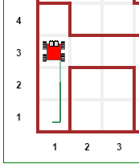

A quick Python introduction: part 2
===================================

By now, you should have understood the code
use to illustrate the basic commands known in Reeborg's World.  In this
section, I will introduce a few more Python keywords and functions, mostly
by showing some brief examples.

Keywords  ``and``
------------------

Suppose we Reeborg needs to find its way out of a maze... Actually, let's
show it in action in one example.

|maze|

.. |maze| image:: ../../images/maze.gif

This is going too fast for you to see exactly what's going on.
If you want to load the maze so that you can try things out,
you need to make sure you have the Documentation menu loaded
and select "Big maze"; it will then
be up to you to write the code. I explain how to do so below.

We know that Reeborg can ``move()`` and ``turn_left()``.
We also know that we can define a ``turn_right()`` instruction.
These three instructions are enough to follow a
twisting path in a maze to find the exit.

The problem is knowing which path to follow...

We want to have Reeborg decide on its own which path to follow.
We know that Reeborg can determine if it can move forward
safely, by using ``front_is_clear()``, and that it can determine
if the path to its right is clear, using ``right_is_clear()``.

There are three types of situation that Reeborg could find
itself in.  First, both the path in front, and the path to its
right could be blocked by walls.

|maze_turn_left|

.. |maze_turn_left| image:: ../../images/maze_turn_left.png

In this case, the only sensible thing for Reeborg to do would
be to turn left.  In Python code, we could write this as::

    if not front_is_clear() and not right_is_clear():
        turn_left()

Here, I have used the Python keyword ``and`` to indicate that
both conditions were required.  I can perhaps make the logic
easier to see using parentheses to group together some terms::

    if (not front_is_clear()) and (not right_is_clear()):
        turn_left()

Second, Reeborg could find that the path to its right is blocked,
but not the path forward.

|maze_move|

.. |maze_move| image:: ../../images/maze_move.png

Here, the sensible thing would be to move forward; the option of
turning left (again) would simply make it spin on the spot::

    if (front_is_clear()) and (not right_is_clear()):
        move()

Third, Reeborg could find that the path to its right is clear:

|maze_turn_right|

In this case, Reeborg should take advantage of this opportunity
to turn right, which it couldn't do in the previous cases,
**and** to take a step in that direction::

    if right_is_clear():
        turn_right()
        move()

By adopting this strategy, Reeborg would end up doing its best
to move forward while keeping a wall immediately to its right.
So, we could encode these three steps into a single function as
follows::

    def follow_right_wall():
        if (not front_is_clear()) and (not right_is_clear()):
            turn_left()
        if (front_is_clear()) and (not right_is_clear()):
            move()
        if right_is_clear():
            turn_right()
            move()

Once this function is defined, as well as ``turn_right()``,
all that is needed for Reeborg to exit the maze is the
following::

    while not at_goal():
        follow_right_wall()

.. topic:: Try it out!

   Before reading further, try the above.  You should be able to
   confirm that it works.

Keywords ``elif`` and ``else``
------------------------------

The above strategy relied on three mutually exclusive cases.
In the first two, the right path was blocked, which was not the
case for the third case.  What distinguished the first and
second cases was whether or not the front path was free of
obstacles.  This can be understood by carefully reading of the
code ... but there is a better way.

Python includes two keywords, ``elif`` and ``else`` to complement
an ``if`` statement and indicate cases that should be considered
as mutually exclusive; by this, we mean that Python will execute
the first code block (and only that one) for which the stated
condition is satisfied. Since ``else`` does not have any condition
attached, if other conditions have not been met, then the code
there is always executed; otherwise, it is skipped over.
Here's how we can rewrite
``follow_right_wall()`` using these keywords::

    def follow_right_wall():
        if right_is_clear():
            turn_right()
            move()
        elif front_is_clear():
            move()
        else:
            turn_left()

Much simpler to read and to understand, once you know that **only one**
of these choices is going to be executed.

By the way, this kind of construct always include only one ``if`` *clause*,
it can include any number (from zero to whatever) of ``elif`` *clauses*,
and include zero or one ``else`` *clause*.

Keyword ``or``
--------------

If we have two conditions::

    if condition_1 or condition_2:
        do_something()

the ``if`` clause will be executed, as long as one of the two conditions
is equivalent to ``True``; when using ``and``, we needed **both** conditions
to be equivalent to ``True``.  For example:

|test_or|

.. |test_or| image:: ../../images/test_or.gif

Keywords ``break`` and ``continue``
------------------------------------

``break`` allows to "get out" of a loop (either a ``for`` loop
or a ``while`` loop) and continue code execution with the code
that comes after the loop.

``continue`` stops execution **within** a loop, and goes back
to the beginning of the loop.

Here are two examples, one for each keyword.

|test_break|

.. |test_break| image:: ../../images/test_break.gif

|test_continue|

.. |test_continue| image:: ../../images/test_continue.gif

Summary of logical keywords
---------------------------

``not``, ``and``, and ``or`` are known as logical keywords, used with
the *boolean* keywords ``True`` and ``False`` or their equivalent.

Summary of control flow keywords
--------------------------------

``for`` (together with ``in``), ``while``, ``if``, ``elif``, ``else``,
``break``, and ``continue`` are often referred to as control flow keywords
as they "control the flow" of execution of the code, determining if some
parts of the code need to be repeated or skipped.

One more keyword: ``pass``
--------------------------

Sometimes, you want to write a program that will have multiple
``if/elif/else`` clauses or some function which you have not yet defined,
etc., but you'd like to test part of it to see if it works as expected.
You may then find the keyword ``pass`` to be useful.  This keyword
tells Python to do ... nothing.  How is that useful you ask?
Here's a bit of a contrived example::

    def follow_right_wall():
        if right_is_clear():
            pass             # need to figure out what to do here
        elif front_is_clear():
            move()
        else:
            turn_left()

Using ``pass`` above allows us to write the code with the proper indentation,
so that it can be run without any syntax errors.
There are other potential uses of this keyword, but this should give you
a good idea of its common use.
