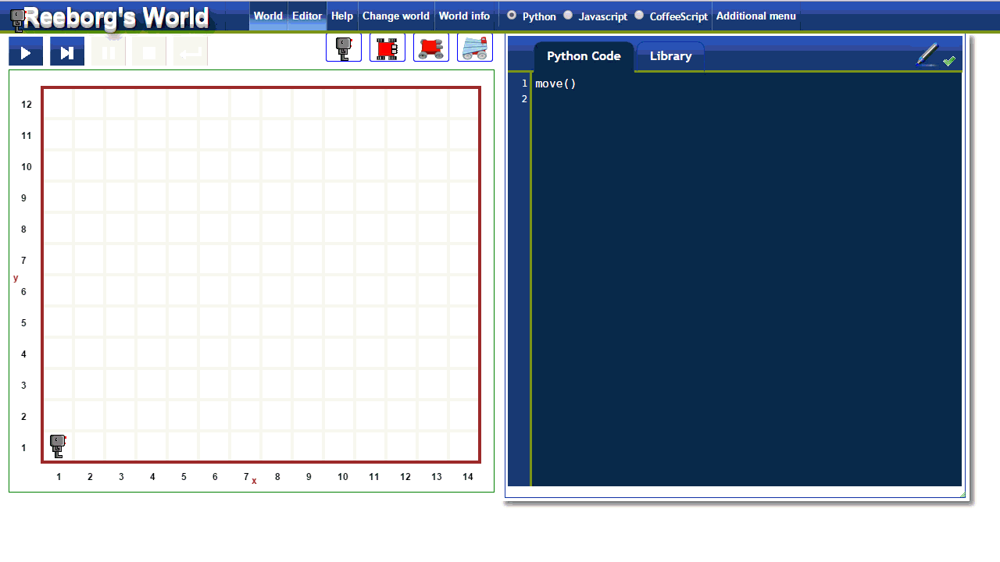

Quick tour of Reeborg's World
==============================

Running programs
----------------

Example of running programs illustrated below:

1. Clicking on the "run" button (red circle), the program in the code editor
   (green rectangle) is executed and the robot (blue rectangle) performs
   the requested actions in the world.  At the end, a dialog window
   appears (red arrow) indicating whether the program was executed successfully
   or not.  This example goes by very quickly.
2. Instead of running the program "all at once", we can step through
   the program's instruction by clicking on the appropriate button
   (red circle).  This example is run a bit more slowly and is likely easier
   to follow.  The program in the code editor is run, with each instruction
   (usually a single line of code) highlighted prior to its execution.
3. In order to highlight instructions, some custom [and hidden] Python code has to be added
   prior to execution.  In some cases, for more complex programs, this extra code causes problems.
   If desired, it is possible to turn off the highlighting of code instructions to
   prevent such problems.
4. The default image used for Reeborg can be changed according to the user's choice.

|running|

Receiving feedback
------------------

Reeborg's world is designed to give clear feedback when a problem is
encountered (for example, Reeborg hits a wall while attempting to move,
or attempts to pick up an object where none is to be found).  Various
"worlds/tasks" can be created requiring Reeborg to be at a certain
location at the end of a program, or to have moved objects to a certain
location.  Below you see four examples of such feedback being given.

|feedback|

Creating new worlds and tasks
-----------------------------

Creating new worlds and basic tasks is easy to accomplish with the
world editor.  These worlds are first saved in the browser and can
be exported either as json files (for the world only) or as
specially crafted permalinks, which includes the code written
in the editor and the library.

|edit-world|

.. |running| image:: ../../images/running_programs.gif
.. |feedback| image:: ../../images/feedback.gif

