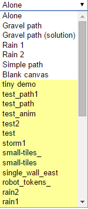
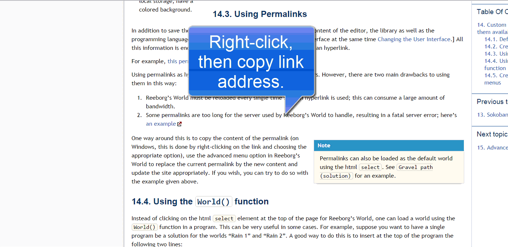

Custom worlds: making them available
====================================

You have created a nice collection of custom worlds and would like
to make this collection easily available to students.
The most convenient way for
students is to host the worlds on a publicly available website
(like Github or your own website) and create custom menus.
However, before explaining how to do this, let's explore the
various ways that worlds can be loaded.

Default worlds
---------------

   Default worlds are shown with a white background.  Worlds created
   locally, and saved in the browser's local storage, have a colored
   background.

Reeborg's World includes a few worlds by default.
Previously, the worlds included were closely tied to a tutorial written
to teach Python.
More recently, the worlds included are chosen because they demonstrate
a specific feature, which is usually referenced somewhere like in
this documentation or on a blogpost.

The default worlds are selected from an html ``select`` element
located at the top of the browser.

Creating worlds
---------------

.. note::

    World creation and edition is adressed elsewhere in this documentation.

When you create a new world (or edit an existing one), you are offered the
option to automatically save it in your browser's local storage.
Once a world is saved, it is appended in the default world selection.
While the names of the default worlds are shown with a white background,
worlds saved in a browser are displayed with a coloured background.

It is also possible to save worlds in a file; the format used is json.
For convenience of the programmer wishing to look at the resulting files,
some additional spaces are inserted which makes it easier to understand
the file contents, and possibly edit it.

Using Permalinks
-----------------

In addition to save the world configuration, it is possible to save
the content of the editor, the library as well as the programming language
used.  [It is also possible to change the user interface at
the same time :ref:`changing-the-user-interface`.]
All this information is encoded in a *permalink* that can be used as
a url in an hyperlink.

For example, `this permalink`_ will load a custom world and solution.

.. _this permalink: http://reeborg.ca/world_dev.html?proglang=python-en&world=%7B%0A%20%20%22robots%22%3A%20%5B%0A%20%20%20%20%7B%0A%20%20%20%20%20%20%22x%22%3A%201%2C%0A%20%20%20%20%20%20%22y%22%3A%201%2C%0A%20%20%20%20%20%20%22tokens%22%3A%20%22infinite%22%2C%0A%20%20%20%20%20%20%22orientation%22%3A%200%2C%0A%20%20%20%20%20%20%22_prev_x%22%3A%201%2C%0A%20%20%20%20%20%20%22_prev_y%22%3A%201%2C%0A%20%20%20%20%20%20%22_prev_orientation%22%3A%200%0A%20%20%20%20%7D%0A%20%20%5D%2C%0A%20%20%22walls%22%3A%20%7B%0A%20%20%20%20%222%2C1%22%3A%20%5B%0A%20%20%20%20%20%20%22east%22%0A%20%20%20%20%5D%2C%0A%20%20%20%20%224%2C1%22%3A%20%5B%0A%20%20%20%20%20%20%22east%22%0A%20%20%20%20%5D%2C%0A%20%20%20%20%226%2C1%22%3A%20%5B%0A%20%20%20%20%20%20%22east%22%0A%20%20%20%20%5D%2C%0A%20%20%20%20%228%2C1%22%3A%20%5B%0A%20%20%20%20%20%20%22east%22%0A%20%20%20%20%5D%2C%0A%20%20%20%20%2210%2C1%22%3A%20%5B%0A%20%20%20%20%20%20%22east%22%0A%20%20%20%20%5D%0A%20%20%7D%2C%0A%20%20%22goal%22%3A%20%7B%0A%20%20%20%20%22possible_positions%22%3A%20%5B%0A%20%20%20%20%20%20%5B%0A%20%20%20%20%20%20%20%208%2C%0A%20%20%20%20%20%20%20%201%0A%20%20%20%20%20%20%5D%0A%20%20%20%20%5D%2C%0A%20%20%20%20%22position%22%3A%20%7B%0A%20%20%20%20%20%20%22image%22%3A%20%22racing_flag%22%2C%0A%20%20%20%20%20%20%22x%22%3A%208%2C%0A%20%20%20%20%20%20%22y%22%3A%201%0A%20%20%20%20%7D%0A%20%20%7D%2C%0A%20%20%22small_tiles%22%3A%20false%2C%0A%20%20%22rows%22%3A%203%2C%0A%20%20%22cols%22%3A%2010%2C%0A%20%20%22pre_code%22%3A%20%22RUR.world.remove_robots()%5Cn%5Cnclass%20RepairedRobot(UsedRobot)%3A%5Cn%20%20%20%20def%20turn_right(self)%3A%5Cn%20%20%20%20%20%20%20%20self.body._orientation%20%2B%3D%203%5Cn%20%20%20%20%20%20%20%20self.body._orientation%20%25%3D%204%5Cn%20%20%20%20%20%20%20%20RUR.rec.record_frame()%5Cn%5Cnr%20%3D%20RepairedRobot()%5Cnturn_right%20%3D%20r.turn_right%5CnRUR.vis_robot.set_trace_style(%5C%22thick%5C%22)%5Cn%22%2C%0A%20%20%22description%22%3A%20%22Hurdle%20race%20by%20better%20robot%22%2C%0A%20%20%22post_code%22%3A%20%22%22%0A%7D&editor=%0Adef%20jump()%3A%0A%20%20%20%20move()%0A%20%20%20%20turn_left()%0A%20%20%20%20move()%0A%20%20%20%20turn_right()%0A%20%20%20%20move()%0A%20%20%20%20turn_right()%0A%20%20%20%20move()%0A%20%20%20%20turn_left()%0A%0Arepeat(jump%2C%203)%0Amove()%0A&library=

.. _an example: http://reeborg.ca/world_dev.html?proglang=python-en&world=%7B%0A%20%20%22robots%22%3A%20%5B%0A%20%20%20%20%7B%0A%20%20%20%20%20%20%22x%22%3A%201%2C%0A%20%20%20%20%20%20%22y%22%3A%201%2C%0A%20%20%20%20%20%20%22orientation%22%3A%200%2C%0A%20%20%20%20%20%20%22_prev_x%22%3A%201%2C%0A%20%20%20%20%20%20%22_prev_y%22%3A%201%2C%0A%20%20%20%20%20%20%22_prev_orientation%22%3A%200%2C%0A%20%20%20%20%20%20%22objects%22%3A%20%7B%0A%20%20%20%20%20%20%20%20%22token%22%3A%202%2C%0A%20%20%20%20%20%20%20%20%22star%22%3A%201%2C%0A%20%20%20%20%20%20%20%20%22triangle%22%3A%20%22infinite%22%0A%20%20%20%20%20%20%7D%2C%0A%20%20%20%20%20%20%22start_positions%22%3A%20%5B%0A%20%20%20%20%20%20%20%20%5B%0A%20%20%20%20%20%20%20%20%20%201%2C%0A%20%20%20%20%20%20%20%20%20%201%0A%20%20%20%20%20%20%20%20%5D%0A%20%20%20%20%20%20%5D%0A%20%20%20%20%7D%0A%20%20%5D%2C%0A%20%20%22walls%22%3A%20%7B%7D%2C%0A%20%20%22description%22%3A%20%22Using%20%3Ccode%3Emove()%3C%2Fcode%3E%2C%20%3Ccode%3Eturn_left()%3C%2Fcode%3E%2C%20%3Ccode%3Efront_is_clear()%3C%2Fcode%3E%2C%20%3Ccode%3Eright_is_clear()%3C%2Fcode%3E%2C%20%3Ccode%3Eat_goal()%3C%2Fcode%3E%20and%20the%20Python%20keywords%20%3Ccode%3Eif%2C%20else%2C%20elif%2C%20while%2C%20not%2C%20def%3C%2Fcode%3E%2C%20have%20Reeborg%20decide%20on%20its%20own%20how%20to%20follow%20the%20path%20so%20it%20can%20go%20home.%5Cn%3Cbr%3E--%3Cbr%3E%3Cem%3EEn%20utilisant%20%3Ccode%3Eavance()%3C%2Fcode%3E%2C%20%3Ccode%3Etourne_a_gauche()%3C%2Fcode%3E%2C%20%3Ccode%3Erien_devant()%3C%2Fcode%3E%2C%20%3Ccode%3Erien_a_droite()%3C%2Fcode%3E%2C%20%3Ccode%3Eau_but()%3C%2Fcode%3E%20et%20les%20mots%20Python%20%3Ccode%3Eif%2C%20else%2C%20elif%2C%20while%2C%20not%2C%20def%3C%2Fcode%3E%2C%20aidez%20Reeborg%20%C3%A0%20trouver%20son%20chemin%20par%20lui-m%C3%AAme%20pour%20qu'il%20puisse%20retourner%20%C3%A0%20sa%20maison%20en%20suivant%20le%20sentier.%3C%2Fem%3E%22%2C%0A%20%20%22small_tiles%22%3A%20false%2C%0A%20%20%22rows%22%3A%2012%2C%0A%20%20%22cols%22%3A%2014%2C%0A%20%20%22tiles%22%3A%20%7B%0A%20%20%20%20%221%2C12%22%3A%20%22grass%22%2C%0A%20%20%20%20%222%2C12%22%3A%20%22grass%22%2C%0A%20%20%20%20%223%2C10%22%3A%20%22grass%22%2C%0A%20%20%20%20%223%2C11%22%3A%20%22grass%22%2C%0A%20%20%20%20%223%2C12%22%3A%20%22grass%22%2C%0A%20%20%20%20%224%2C12%22%3A%20%22grass%22%2C%0A%20%20%20%20%224%2C11%22%3A%20%22grass%22%2C%0A%20%20%20%20%224%2C10%22%3A%20%22grass%22%2C%0A%20%20%20%20%224%2C9%22%3A%20%22grass%22%2C%0A%20%20%20%20%224%2C8%22%3A%20%22water%22%2C%0A%20%20%20%20%223%2C8%22%3A%20%22water%22%2C%0A%20%20%20%20%223%2C9%22%3A%20%22grass%22%2C%0A%20%20%20%20%222%2C9%22%3A%20%22water%22%2C%0A%20%20%20%20%222%2C8%22%3A%20%22water%22%2C%0A%20%20%20%20%221%2C8%22%3A%20%22grass%22%2C%0A%20%20%20%20%221%2C9%22%3A%20%22water%22%2C%0A%20%20%20%20%222%2C10%22%3A%20%22water%22%2C%0A%20%20%20%20%221%2C10%22%3A%20%22water%22%2C%0A%20%20%20%20%221%2C11%22%3A%20%22water%22%2C%0A%20%20%20%20%221%2C7%22%3A%20%22grass%22%2C%0A%20%20%20%20%222%2C7%22%3A%20%22grass%22%2C%0A%20%20%20%20%223%2C7%22%3A%20%22grass%22%2C%0A%20%20%20%20%223%2C6%22%3A%20%22grass%22%2C%0A%20%20%20%20%222%2C6%22%3A%20%22grass%22%2C%0A%20%20%20%20%221%2C6%22%3A%20%22grass%22%2C%0A%20%20%20%20%221%2C5%22%3A%20%22grass%22%2C%0A%20%20%20%20%222%2C5%22%3A%20%22grass%22%2C%0A%20%20%20%20%223%2C5%22%3A%20%22grass%22%2C%0A%20%20%20%20%223%2C4%22%3A%20%22grass%22%2C%0A%20%20%20%20%222%2C4%22%3A%20%22grass%22%2C%0A%20%20%20%20%223%2C3%22%3A%20%22grass%22%2C%0A%20%20%20%20%224%2C4%22%3A%20%22grass%22%2C%0A%20%20%20%20%224%2C5%22%3A%20%22water%22%2C%0A%20%20%20%20%224%2C6%22%3A%20%22water%22%2C%0A%20%20%20%20%225%2C6%22%3A%20%22grass%22%2C%0A%20%20%20%20%225%2C7%22%3A%20%22grass%22%2C%0A%20%20%20%20%224%2C7%22%3A%20%22water%22%2C%0A%20%20%20%20%221%2C1%22%3A%20%22gravel%22%2C%0A%20%20%20%20%222%2C1%22%3A%20%22gravel%22%2C%0A%20%20%20%20%223%2C1%22%3A%20%22gravel%22%2C%0A%20%20%20%20%224%2C1%22%3A%20%22gravel%22%2C%0A%20%20%20%20%224%2C2%22%3A%20%22gravel%22%2C%0A%20%20%20%20%224%2C3%22%3A%20%22gravel%22%2C%0A%20%20%20%20%225%2C3%22%3A%20%22gravel%22%2C%0A%20%20%20%20%226%2C3%22%3A%20%22gravel%22%2C%0A%20%20%20%20%227%2C3%22%3A%20%22gravel%22%2C%0A%20%20%20%20%227%2C4%22%3A%20%22gravel%22%2C%0A%20%20%20%20%227%2C5%22%3A%20%22water%22%2C%0A%20%20%20%20%227%2C6%22%3A%20%22grass%22%2C%0A%20%20%20%20%227%2C7%22%3A%20%22grass%22%2C%0A%20%20%20%20%228%2C7%22%3A%20%22grass%22%2C%0A%20%20%20%20%229%2C7%22%3A%20%22grass%22%2C%0A%20%20%20%20%2210%2C7%22%3A%20%22gravel%22%2C%0A%20%20%20%20%2210%2C8%22%3A%20%22gravel%22%2C%0A%20%20%20%20%2210%2C9%22%3A%20%22gravel%22%2C%0A%20%20%20%20%2211%2C9%22%3A%20%22gravel%22%2C%0A%20%20%20%20%2212%2C9%22%3A%20%22gravel%22%2C%0A%20%20%20%20%2212%2C10%22%3A%20%22gravel%22%2C%0A%20%20%20%20%2212%2C11%22%3A%20%22gravel%22%2C%0A%20%20%20%20%2213%2C11%22%3A%20%22gravel%22%2C%0A%20%20%20%20%2214%2C11%22%3A%20%22gravel%22%2C%0A%20%20%20%20%2214%2C12%22%3A%20%22grass%22%2C%0A%20%20%20%20%222%2C11%22%3A%20%22water%22%2C%0A%20%20%20%20%225%2C5%22%3A%20%22water%22%2C%0A%20%20%20%20%226%2C5%22%3A%20%22water%22%2C%0A%20%20%20%20%228%2C5%22%3A%20%22water%22%2C%0A%20%20%20%20%229%2C5%22%3A%20%22water%22%2C%0A%20%20%20%20%2210%2C5%22%3A%20%22water%22%2C%0A%20%20%20%20%2211%2C5%22%3A%20%22water%22%2C%0A%20%20%20%20%2211%2C4%22%3A%20%22water%22%2C%0A%20%20%20%20%2212%2C4%22%3A%20%22water%22%2C%0A%20%20%20%20%2213%2C4%22%3A%20%22water%22%2C%0A%20%20%20%20%2213%2C3%22%3A%20%22water%22%2C%0A%20%20%20%20%2214%2C3%22%3A%20%22water%22%2C%0A%20%20%20%20%2212%2C3%22%3A%20%22water%22%2C%0A%20%20%20%20%2211%2C3%22%3A%20%22water%22%2C%0A%20%20%20%20%2211%2C2%22%3A%20%22water%22%2C%0A%20%20%20%20%2212%2C2%22%3A%20%22water%22%2C%0A%20%20%20%20%2213%2C2%22%3A%20%22water%22%2C%0A%20%20%20%20%2214%2C2%22%3A%20%22water%22%2C%0A%20%20%20%20%2214%2C1%22%3A%20%22water%22%2C%0A%20%20%20%20%2213%2C1%22%3A%20%22water%22%2C%0A%20%20%20%20%2212%2C1%22%3A%20%22water%22%2C%0A%20%20%20%20%2211%2C1%22%3A%20%22water%22%2C%0A%20%20%20%20%225%2C12%22%3A%20%22grass%22%2C%0A%20%20%20%20%226%2C12%22%3A%20%22grass%22%2C%0A%20%20%20%20%226%2C11%22%3A%20%22grass%22%2C%0A%20%20%20%20%225%2C11%22%3A%20%22grass%22%2C%0A%20%20%20%20%225%2C10%22%3A%20%22grass%22%2C%0A%20%20%20%20%225%2C9%22%3A%20%22grass%22%2C%0A%20%20%20%20%225%2C8%22%3A%20%22grass%22%2C%0A%20%20%20%20%226%2C8%22%3A%20%22grass%22%2C%0A%20%20%20%20%226%2C7%22%3A%20%22grass%22%2C%0A%20%20%20%20%226%2C6%22%3A%20%22grass%22%2C%0A%20%20%20%20%226%2C4%22%3A%20%22grass%22%2C%0A%20%20%20%20%225%2C4%22%3A%20%22grass%22%2C%0A%20%20%20%20%225%2C2%22%3A%20%22grass%22%2C%0A%20%20%20%20%226%2C2%22%3A%20%22grass%22%2C%0A%20%20%20%20%225%2C1%22%3A%20%22grass%22%2C%0A%20%20%20%20%226%2C1%22%3A%20%22grass%22%2C%0A%20%20%20%20%227%2C1%22%3A%20%22grass%22%2C%0A%20%20%20%20%227%2C2%22%3A%20%22grass%22%2C%0A%20%20%20%20%228%2C2%22%3A%20%22grass%22%2C%0A%20%20%20%20%228%2C3%22%3A%20%22grass%22%2C%0A%20%20%20%20%228%2C4%22%3A%20%22gravel%22%2C%0A%20%20%20%20%229%2C4%22%3A%20%22gravel%22%2C%0A%20%20%20%20%2210%2C4%22%3A%20%22gravel%22%2C%0A%20%20%20%20%2210%2C2%22%3A%20%22grass%22%2C%0A%20%20%20%20%229%2C2%22%3A%20%22grass%22%2C%0A%20%20%20%20%229%2C3%22%3A%20%22grass%22%2C%0A%20%20%20%20%2210%2C3%22%3A%20%22grass%22%2C%0A%20%20%20%20%2210%2C1%22%3A%20%22grass%22%2C%0A%20%20%20%20%229%2C1%22%3A%20%22grass%22%2C%0A%20%20%20%20%228%2C1%22%3A%20%22grass%22%2C%0A%20%20%20%20%223%2C2%22%3A%20%22grass%22%2C%0A%20%20%20%20%222%2C2%22%3A%20%22grass%22%2C%0A%20%20%20%20%222%2C3%22%3A%20%22grass%22%2C%0A%20%20%20%20%221%2C3%22%3A%20%22grass%22%2C%0A%20%20%20%20%221%2C4%22%3A%20%22grass%22%2C%0A%20%20%20%20%221%2C2%22%3A%20%22grass%22%2C%0A%20%20%20%20%227%2C8%22%3A%20%22grass%22%2C%0A%20%20%20%20%228%2C8%22%3A%20%22grass%22%2C%0A%20%20%20%20%229%2C8%22%3A%20%22grass%22%2C%0A%20%20%20%20%229%2C9%22%3A%20%22grass%22%2C%0A%20%20%20%20%228%2C9%22%3A%20%22grass%22%2C%0A%20%20%20%20%227%2C9%22%3A%20%22grass%22%2C%0A%20%20%20%20%226%2C9%22%3A%20%22grass%22%2C%0A%20%20%20%20%226%2C10%22%3A%20%22grass%22%2C%0A%20%20%20%20%227%2C10%22%3A%20%22grass%22%2C%0A%20%20%20%20%228%2C10%22%3A%20%22grass%22%2C%0A%20%20%20%20%229%2C10%22%3A%20%22grass%22%2C%0A%20%20%20%20%2210%2C10%22%3A%20%22grass%22%2C%0A%20%20%20%20%2211%2C10%22%3A%20%22grass%22%2C%0A%20%20%20%20%2211%2C11%22%3A%20%22grass%22%2C%0A%20%20%20%20%2211%2C12%22%3A%20%22grass%22%2C%0A%20%20%20%20%2212%2C12%22%3A%20%22grass%22%2C%0A%20%20%20%20%2213%2C12%22%3A%20%22grass%22%2C%0A%20%20%20%20%2210%2C12%22%3A%20%22grass%22%2C%0A%20%20%20%20%2210%2C11%22%3A%20%22grass%22%2C%0A%20%20%20%20%229%2C11%22%3A%20%22grass%22%2C%0A%20%20%20%20%229%2C12%22%3A%20%22grass%22%2C%0A%20%20%20%20%228%2C12%22%3A%20%22grass%22%2C%0A%20%20%20%20%228%2C11%22%3A%20%22grass%22%2C%0A%20%20%20%20%227%2C11%22%3A%20%22grass%22%2C%0A%20%20%20%20%227%2C12%22%3A%20%22grass%22%2C%0A%20%20%20%20%228%2C6%22%3A%20%22grass%22%2C%0A%20%20%20%20%229%2C6%22%3A%20%22grass%22%2C%0A%20%20%20%20%2210%2C6%22%3A%20%22gravel%22%2C%0A%20%20%20%20%2211%2C6%22%3A%20%22grass%22%2C%0A%20%20%20%20%2212%2C6%22%3A%20%22grass%22%2C%0A%20%20%20%20%2212%2C5%22%3A%20%22grass%22%2C%0A%20%20%20%20%2213%2C5%22%3A%20%22grass%22%2C%0A%20%20%20%20%2214%2C5%22%3A%20%22grass%22%2C%0A%20%20%20%20%2214%2C4%22%3A%20%22grass%22%2C%0A%20%20%20%20%2214%2C6%22%3A%20%22grass%22%2C%0A%20%20%20%20%2213%2C6%22%3A%20%22grass%22%2C%0A%20%20%20%20%2211%2C7%22%3A%20%22grass%22%2C%0A%20%20%20%20%2211%2C8%22%3A%20%22grass%22%2C%0A%20%20%20%20%2212%2C8%22%3A%20%22grass%22%2C%0A%20%20%20%20%2212%2C7%22%3A%20%22grass%22%2C%0A%20%20%20%20%2213%2C7%22%3A%20%22grass%22%2C%0A%20%20%20%20%2214%2C7%22%3A%20%22grass%22%2C%0A%20%20%20%20%2214%2C8%22%3A%20%22grass%22%2C%0A%20%20%20%20%2213%2C8%22%3A%20%22grass%22%2C%0A%20%20%20%20%2213%2C9%22%3A%20%22grass%22%2C%0A%20%20%20%20%2214%2C9%22%3A%20%22grass%22%2C%0A%20%20%20%20%2213%2C10%22%3A%20%22grass%22%2C%0A%20%20%20%20%2214%2C10%22%3A%20%22grass%22%0A%20%20%7D%2C%0A%20%20%22objects%22%3A%20%7B%0A%20%20%20%20%222%2C6%22%3A%20%7B%0A%20%20%20%20%20%20%22dandelion%22%3A%201%0A%20%20%20%20%7D%2C%0A%20%20%20%20%226%2C10%22%3A%20%7B%0A%20%20%20%20%20%20%22dandelion%22%3A%201%0A%20%20%20%20%7D%2C%0A%20%20%20%20%225%2C10%22%3A%20%7B%0A%20%20%20%20%20%20%22dandelion%22%3A%201%0A%20%20%20%20%7D%2C%0A%20%20%20%20%225%2C11%22%3A%20%7B%0A%20%20%20%20%20%20%22dandelion%22%3A%201%0A%20%20%20%20%7D%2C%0A%20%20%20%20%226%2C1%22%3A%20%7B%0A%20%20%20%20%20%20%22tulip%22%3A%201%0A%20%20%20%20%7D%2C%0A%20%20%20%20%227%2C12%22%3A%20%7B%0A%20%20%20%20%20%20%22daisy%22%3A%201%0A%20%20%20%20%7D%2C%0A%20%20%20%20%2214%2C7%22%3A%20%7B%0A%20%20%20%20%20%20%22daisy%22%3A%201%0A%20%20%20%20%7D%2C%0A%20%20%20%20%221%2C4%22%3A%20%7B%0A%20%20%20%20%20%20%22daisy%22%3A%201%0A%20%20%20%20%7D%2C%0A%20%20%20%20%2214%2C5%22%3A%20%7B%0A%20%20%20%20%20%20%22tulip%22%3A%201%0A%20%20%20%20%7D%2C%0A%20%20%20%20%227%2C1%22%3A%20%7B%0A%20%20%20%20%20%20%22daisy%22%3A%201%0A%20%20%20%20%7D%2C%0A%20%20%20%20%223%2C10%22%3A%20%7B%0A%20%20%20%20%20%20%22tulip%22%3A%201%0A%20%20%20%20%7D%2C%0A%20%20%20%20%224%2C9%22%3A%20%7B%0A%20%20%20%20%20%20%22tulip%22%3A%201%0A%20%20%20%20%7D%2C%0A%20%20%20%20%229%2C6%22%3A%20%7B%0A%20%20%20%20%20%20%22tulip%22%3A%201%0A%20%20%20%20%7D%2C%0A%20%20%20%20%226%2C2%22%3A%20%7B%0A%20%20%20%20%20%20%22daisy%22%3A%201%0A%20%20%20%20%7D%2C%0A%20%20%20%20%2213%2C12%22%3A%20%7B%0A%20%20%20%20%20%20%22tulip%22%3A%201%0A%20%20%20%20%7D%0A%20%20%7D%2C%0A%20%20%22top_tiles%22%3A%20%7B%0A%20%20%20%20%225%2C1%22%3A%20%7B%0A%20%20%20%20%20%20%22fence_vertical%22%3A%201%0A%20%20%20%20%7D%2C%0A%20%20%20%20%223%2C3%22%3A%20%7B%0A%20%20%20%20%20%20%22fence_vertical%22%3A%201%0A%20%20%20%20%7D%2C%0A%20%20%20%20%223%2C4%22%3A%20%7B%0A%20%20%20%20%20%20%22fence_vertical%22%3A%201%2C%0A%20%20%20%20%20%20%22fence_right%22%3A%201%0A%20%20%20%20%7D%2C%0A%20%20%20%20%224%2C4%22%3A%20%7B%0A%20%20%20%20%20%20%22fence_left%22%3A%201%0A%20%20%20%20%7D%2C%0A%20%20%20%20%228%2C2%22%3A%20%7B%0A%20%20%20%20%20%20%22fence_left%22%3A%201%0A%20%20%20%20%7D%2C%0A%20%20%20%20%227%2C2%22%3A%20%7B%0A%20%20%20%20%20%20%22fence_right%22%3A%201%0A%20%20%20%20%7D%2C%0A%20%20%20%20%223%2C2%22%3A%20%7B%0A%20%20%20%20%20%20%22fence_left%22%3A%201%0A%20%20%20%20%7D%2C%0A%20%20%20%20%222%2C2%22%3A%20%7B%0A%20%20%20%20%20%20%22fence_double%22%3A%201%0A%20%20%20%20%7D%2C%0A%20%20%20%20%221%2C2%22%3A%20%7B%0A%20%20%20%20%20%20%22fence_right%22%3A%201%0A%20%20%20%20%7D%2C%0A%20%20%20%20%2213%2C8%22%3A%20%7B%0A%20%20%20%20%20%20%22fence_left%22%3A%201%0A%20%20%20%20%7D%2C%0A%20%20%20%20%2213%2C9%22%3A%20%7B%0A%20%20%20%20%20%20%22fence_vertical%22%3A%201%0A%20%20%20%20%7D%2C%0A%20%20%20%20%2213%2C10%22%3A%20%7B%0A%20%20%20%20%20%20%22fence_right%22%3A%201%2C%0A%20%20%20%20%20%20%22fence_vertical%22%3A%201%0A%20%20%20%20%7D%2C%0A%20%20%20%20%2214%2C10%22%3A%20%7B%0A%20%20%20%20%20%20%22fence_left%22%3A%201%0A%20%20%20%20%7D%2C%0A%20%20%20%20%2211%2C12%22%3A%20%7B%0A%20%20%20%20%20%20%22fence_right%22%3A%201%2C%0A%20%20%20%20%20%20%22fence_vertical%22%3A%201%0A%20%20%20%20%7D%2C%0A%20%20%20%20%2212%2C12%22%3A%20%7B%0A%20%20%20%20%20%20%22fence_left%22%3A%201%0A%20%20%20%20%7D%2C%0A%20%20%20%20%2211%2C11%22%3A%20%7B%0A%20%20%20%20%20%20%22fence_vertical%22%3A%201%0A%20%20%20%20%7D%2C%0A%20%20%20%20%2210%2C10%22%3A%20%7B%0A%20%20%20%20%20%20%22fence_right%22%3A%201%0A%20%20%20%20%7D%2C%0A%20%20%20%20%2211%2C10%22%3A%20%7B%0A%20%20%20%20%20%20%22fence_left%22%3A%201%0A%20%20%20%20%7D%2C%0A%20%20%20%20%2210%2C5%22%3A%20%7B%0A%20%20%20%20%20%20%22bridge%22%3A%201%0A%20%20%20%20%7D%2C%0A%20%20%20%20%2212%2C8%22%3A%20%7B%0A%20%20%20%20%20%20%22fence_right%22%3A%201%0A%20%20%20%20%7D%2C%0A%20%20%20%20%2210%2C3%22%3A%20%7B%0A%20%20%20%20%20%20%22fence_left%22%3A%201%0A%20%20%20%20%7D%2C%0A%20%20%20%20%229%2C3%22%3A%20%7B%0A%20%20%20%20%20%20%22fence_double%22%3A%201%0A%20%20%20%20%7D%2C%0A%20%20%20%20%228%2C3%22%3A%20%7B%0A%20%20%20%20%20%20%22fence_right%22%3A%201%2C%0A%20%20%20%20%20%20%22fence_vertical%22%3A%201%0A%20%20%20%20%7D%2C%0A%20%20%20%20%225%2C2%22%3A%20%7B%0A%20%20%20%20%20%20%22fence_vertical%22%3A%201%2C%0A%20%20%20%20%20%20%22fence_right%22%3A%201%0A%20%20%20%20%7D%2C%0A%20%20%20%20%226%2C2%22%3A%20%7B%0A%20%20%20%20%20%20%22fence_double%22%3A%201%0A%20%20%20%20%7D%0A%20%20%7D%2C%0A%20%20%22goal%22%3A%20%7B%0A%20%20%20%20%22possible_positions%22%3A%20%5B%0A%20%20%20%20%20%20%5B%0A%20%20%20%20%20%20%20%2014%2C%0A%20%20%20%20%20%20%20%2012%0A%20%20%20%20%20%20%5D%0A%20%20%20%20%5D%2C%0A%20%20%20%20%22position%22%3A%20%7B%0A%20%20%20%20%20%20%22image%22%3A%20%22house%22%2C%0A%20%20%20%20%20%20%22x%22%3A%2014%2C%0A%20%20%20%20%20%20%22y%22%3A%2012%0A%20%20%20%20%7D%0A%20%20%7D%0A%7D&editor=think(100)%0Awhile%20not%20at_goal()%3A%0A%20%20%20%20if%20front_is_clear()%3A%0A%20%20%20%20%20%20%20%20move()%0A%20%20%20%20elif%20right_is_clear()%3A%0A%20%20%20%20%20%20%20%20turn_left()%0A%20%20%20%20%20%20%20%20turn_left()%0A%20%20%20%20%20%20%20%20turn_left()%0A%20%20%20%20else%3A%0A%20%20%20%20%20%20%20%20turn_left()%0A%0A&library=%0A

Using permalinks as hyperlinks can be very effective for tutorial
writers.  However, there are two main drawbacks to using them in this way:

1. Reeborg's World must be reloaded every single time such an hyperlink
   is used; this can consume a large amount of bandwidth.

2. Some permalinks are too long for the server used by Reeborg's World to
   handle, resulting in a fatal server error; here's `an example`_

.. note::

    Permalinks can also be loaded using the html
    ``select``.  See ``Gravel path (solution)`` for an example.

One way around this is to copy the content of the permalink (on Windows,
this is done by right-clicking on the link and choosing the appropriate
option), use the advanced menu option in Reeborg's World to replace the
current permalink by the new content and update the site appropriately.
If you wish, you can try to do so with the example given above.

|update permalink|

Using the ``World()`` function
------------------------------

Instead of clicking on the html ``select`` element at the top of the
page for Reeborg's World, one can load a world using the
``World()`` function in a program.   This can be very useful in some
cases.  For example, suppose you want to have a single program
be a solution for the worlds "Rain 1" and "Rain 2".  A good way to
do this is to insert at the top of the program the following two lines::

    #World("Rain 1")
    #World("Rain 2")
    ...

By uncommenting the appropriate one, upon executing the program, the world
selection will change to the appropriate world (and end the program's
execution) if the world was not already selected.  If the world was selected
(perhaps after having run the program once), then the ``World()`` function
call will be ignored and the rest of the program will be executed as is.

.. note::

    If you are using the French version of the site, the corresponding
    function is called ``Monde()``.

Note that this will work whether the selection is simply for a "world" or if
if it is for a permalink; however, in the latter case, the editor's content
will be replaced by the relevant content from the permalink.   For example,
try executing the following one-line program::

    World("Gravel path (solution)")

Notice how the html ``select`` has been changed after running this program
and how the editor now contains a "solution" to this task.  This also
works for worlds that you create and that are saved in the browser -
provided you use names that are different from the default worlds.
If you use a name identical to one from the pre-defined worlds,
you can still access it in a program
by writing  ``user_world:`` before the name of your world as follows::

    World("user_world:My World")

Note that only the world content (and not that of the editor or the
library) is affected here.

There is another way in which ``World()`` can be used;
this is probably the most useful way.

Suppose you have saved a world file, or a permalink (in a file) on a
publicly accessible website.  You can load the relevant world (or permalink)
using::

    World(full_url)

As a concrete example, you can try::

    World("http://personnel.usainteanne.ca/aroberge/reeborg/test_sokoban1")

.. important::

   Loading files from external servers is done using a third-party server
   (cors-anywhere.herokuapp.com)
   that enables *Cross-origin resource sharing*.   I have noticed on
   at least one occasion that this service was unavailable for a few minutes.

Creating custom menus
---------------------

If you have read all of hte above, you are now ready to understand all
that is required to create a custom menu that uses your own world.
What you need to do is to use the editor and write a program that uses
the function ``MakeCustomMenu``::

    contents = [ [full_url_1, name_1],
                 [full_url_2, name_2],
                 [full_url_3, name_3],
                 ... ]
    MakeCustomMenu(contents)

.. note::

    If you are using the French version of the site, the corresponding
    function is called ``MenuPersonalisé()``.

Then, create a permalink and save it to a file.   Loading this
file using ``World()`` will bring up the corresponding content.
Executing this new program will create a custom menu, which will replace
the existing content of the html ``select`` element at the top of the page.

As an example, try executing::

    World('http://personnel.usainteanne.ca/aroberge/reeborg/custom_menu')

Doing so will bring an example of creating a custom menus from
worlds (including permalinks) found on two different sites.  Running
this example will change the html select so that only the worlds
listed in the example will appear in the html ``select`` element.

