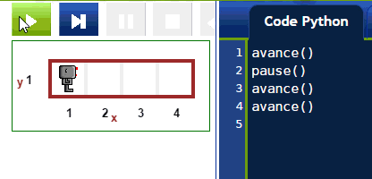
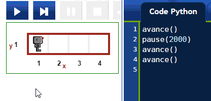

Prend une pause et pense
=========================

.. index:: pause(ms)

Il y a très longtemps, lorsque nous avons discuté de bogues,
nous avons mentionné l'instruction ``pause()``.  Lorsque Reeborg
rencontre cette instruction, il fait une pause ... jusqu'à ce que l'on
clique sur un bouton pour le redémarrer.

En fait, la fonction ``pause()`` peut prendre un argument **optionnel**
qui est le nombre de millisecondes pendant lequel Reeborg doit faire
une pause, avant de continuer l'exécution par lui-même.

.. note::

    Une milliseconde est un millième de seconde.
    Ceci veut dire que ça prend 1000 millisecondes
    pour égaler une seconde.

.. topic::  Essayez!

    Écrivez un programme qui contient des pauses de différentes durées.

Pense
-----

.. index:: pense(ms)

.. note::

    Pour que l'on voit Reeborg se déplacer sur l'écran, plusieurs
    fonctions que vous ne voyez pas doivent être exécutées.
    Ceci ne peut pas arriver instantément ... mais c'est généralement
    assez rapide.  En utilisant ``pense()``, on rajoute un délai **additionnel**
    à l'exécution; par défaut, ce temps additionnel est égal à 250 millisecondes
    (soit un quart de seconde).

Jusqu'à présent, en excluant l'utilisation de la fonction ``pause()``,
vous avez écrit des programmes que Reeborg exécutait à un rythme
constant.  D'une certaine façon, c'est comme si Reeborg **pense**
pendant un certain temps avant d'exécuter chaque instruction.
Il est possible de contrôler la quantité de temps (additionnel) pris
par Reeborg pour montrer le résultat de chacune de ses actions.
Pour faire ceci, vous pouvez utiliser la fonction
``pense(ms)`` où ``ms`` est un argument entier qui représente
le temps (additionel) en millisecondes requis par Reeborg
pour faire chaque action.

.. topic:: À votre tour!

    Écrivez un programme qui utilise ``pense(ms)``.  Vous pouvez utilisez
    ``pense(ms)`` à différents endroits dans votre programme, et changer
    la valeur de l'argument ``ms`` à chaque fois.  Pour que Reeborg
    se déplace le plus vite possible, utilisez ``pense(0)``.

