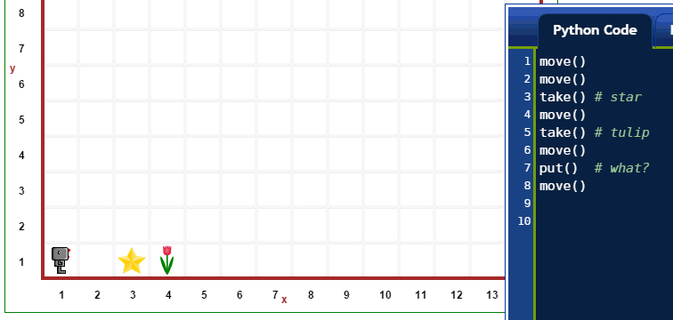
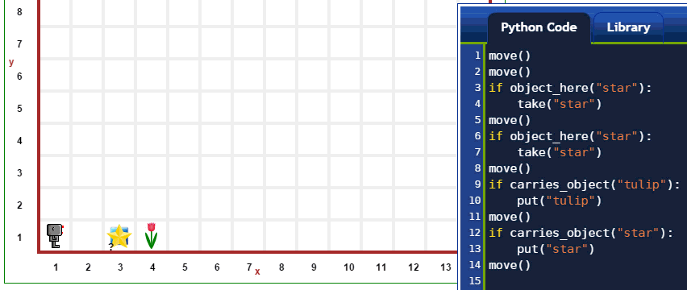

고급 프로그래밍
=========================

한가지 이상 객체 유형을 갖게 되면 자연스러운 방식으로 고급 프로그래밍을 학습할 수 있게 된다.
다음에 어떻게 가능하지 간략하게 살펴보자.

다수 객체 유형을 갖는 세상
-------------------------------------

지금까지 살펴봤듯이, 리보그가 객체를 ``take()`` 혹은 ``put()`` 하도록 지시받으면,
단지 한가지 유형의 객체만 있기 때문에, 모호성이 전혀 없이 작업을 수행할 수 있다.
하지만, 리보그가 다른 유형의 객체를 두개 (그 이상) 지니고 다니면서,
객체를 ``put()`` 해서 놓도록 지시하면 어떨까?

|put_error|

위에서 보듯이, 상기와 같이 지시하면, 리보그가 불평하게 된다.
리보그가 작업을 적절하게 완수하려면, 
함수 *인자(argument)*를 사용해서 어떤 유형의 객체인지 명세할 필요가 있다 -
이 경우에, 객체명을 갖는 파이썬 문자열로 명세한다.

|put_ok|

.. |put_ok| image:: ../../images/put_ok.gif

``take()`` 와 ``put()`` 명령어는 객체 명칭을 갖는 파이썬 문자열을 인자로 받는다.
추가로, 다음 예제에서 볼 수 있듯이, 
``object_here()`` 와 ``carries_object()`` 도 동일하다.

|take_star|

상기 세상에서 동일 장소에 두가지 유형의 객체 (별과, 정사각형)가 있음에 주목한다:
이 경우에, 물음표가 객체 숫자를 나타내는 정수 대신에 나와있다.
해당 지점에 정확한 객체 숫자에 관한 정보는 상단에 "World info" 버튼을 클릭하고 나서,
해당 지점에 객체 이미지를 클릭해서 얻어낼 수 있다.

``object_here()`` 와 ``carries_object()`` 명령어가 파이썬 리스트를 반환하는데,
빈 리스트는 ``False``와 동등하게 처리된다.

|object_here_list|

.. |object_here_list| image:: ../../images/object_here_list.gif

인자를 갖는 다른 함수
-------------------------------

상기 함수에 추가해서, 리보그 세상에 다른 함수는 하나 혹은 그이상 인자를 받을 수 있다.
예를 들어, ``pause()`` 명령어를 살펴봤다:
인자 없이 사용될 때, 리보그가 다시 이동하려면, "run" 혹은 "step" 버튼을 사용자가 클릭해야 된다.
하지만, 정수를 인자로 넣을 수 있고, 1000분의 1초로 해당 숫자만큼 멈추게 된다.
따라서, 1초 동안 멈추려면, ``pause(1000)`` 와 같이 작성한다:

.. code-block:: python

    for i in range(3):
        turn_left()

상기 코드는 초보자에게 즉각적으로 명확하지는 않다.
자바스크립트로 작성하면 상황은 더욱 심각해진다:

.. code-block:: javascript

    for (var i = 0; i < 3; i++){
        turn_left();
    }

대조적으로, 귀도 반 로봇 (http://gvr.sourceforge.net) 미니 언어를 사용하면,
동일한 내용으로 상기 코드를 다음과 같이 단순히 작성할 수 있다::

    do 3:
        turnLeft

.. note::

    파이썬으로 ``repeat`` 을 상대적으로 단순하게 구현하면 다음과 같다:

    .. code-block:: python

        def repeat(fn, n):
            for i in range(n):
                fn()

함수 ``repeat()`` 이 리보그 세상에 단순성을 나타내려는 노력으로 포함되어 있따.
따라서, 왼쪽 세번 회전을 하려면, 다음과 같이 작성한다::

    repeat( turn_left, 3)

Reeborg로부터 의사소통
---------------------------

사용자에게 정보를 의사소통하는데, 리보그는 파이썬 ``print()`` 함수를 사용한다.
``print()`` 함수 출력값이 html 미리 정의된 서식요소(preformatted element)로 나타난다.
이를 통해 줄바꿈과 기타 공백이 적절하게 재현되도록 확실히 하게 된다.

또다른 함수 ``narration()`` 은 인자로 어떤 html 코드로 받을 수 있고 출력도 할 수 있다.
기본 디폴트 설정으로, ``narration()`` 출력결과는 파란색으로 표식되지만,
사용자가 친숙한 html, css 조합으로 변경될 수 있다.

리스트로 작업
-------------------

위에서 언급된 ``object_here()`` 와 ``carries_object()`` 에 추가해서,
리보그 세상이 리스트로 작업할 수 있는 엄청난 가능성을 제공한다.
예를 들어, 리보그가 격자에 진열된 객체를,
동일한 격자 구조를 유지한 채, 새로운 지점으로 옮기도록 할 수 있다:
이 작업을 리스트에 대한 리스트로 수행할 수 있다.

아래에, 예제를 시연하고 있는데, 리보그가

1. 잡초를 제거하면서 총계를 세어나간다.
2. 각 지점에 딸기 갯수를 센다.
3. 정보를 적어 넣는다.

임의 잡초 갯수(0에서 3)와 딸기 갯수(1에서 10)가 각 지점에서 발견되도록 세상을 설계했음에 주목한다;
잡초와 딸기 갯수는 매번 임의로 선정된다.

아래 예제에서 주목할 점이 몇가지 있다:

1. ``RUR.MAX_STEPS`` 값을 기본 디폴트 설정값 1,000에서 2,000으로 증가시켰다;
    종종 작업을 완수하기 전에 멈추는 것을 알게 되었다.
    리보그 프로그램이 실행되는 방식이 화면에는 어떤 것도 보여지지 않고, 매우 빠르게 먼저 실행된다.
    실행되는 동안에, 다양한 명령어가 한번에 하나씩(혹은 역순으로) 재생될 수 있는 "프레임(frame)"을 기록해서,
    사용자가 볼 수 있는 애니메이션을 생성한다. 만약 프레임 기록 횟수가 최대값을 넘게되면,
    프로그램은 정지한다: 이 기능이 무한 루프를 방지하도록 돕는다.
2. ``think(0)`` 명령어를 사용해서 애니메이션을 매우 빠르게 진행시켜 코드가 강조되어 하이라이트 되는 
    기능을 비활성화 시킨다.
3. 시작 시점에, "world information"을 보여준다; 잡초(민들레) 값이 0에서 3이 되고, 
    딸기 값이 1에서 10이 됨이 나타난다.
4. 그리고 나서, 단일 명령어를 실행하면, 잡초와 딸기 갯수가 선택된 것을 보여준다;
    매번 임의 방식으로 작업이 수행된다.

|list|

.. |list| image:: ../../images/list.gif

*만약 매우 관찰력이 좋다면, 리보그에서 사용되는 폰트가 이전 예제 폰트와 다름에 주목한다.
이 문서를 작성할 때, 이전 폰트는 로봇에 좀더 적합한 것으로, ``{}`` 같은 특정 문자가 가독성이 
떨어지는 것을 저자가 뒤늦게 인식하게 되었다. 가독성은 프로그래밍에서 매우 중요하다.
이상적인 폰트에 대한 탐색은 계속된다...*

반환 문장(Return statement)
------------------------------------------

앞에서 살펴봤듯이, 리보그는 북쪽을 향하고 있느지 ... 아닌지 판단할 수 이따.
하지만, 다른 방향을 향하도록 알아내도록 도움을 줄 수 있다.
예를 들어, 리보그가 남쪽을 향하고 있다면, 왼쪽으로 두번 회전을 하면, 북쪽을 향하게 됨을 알고 있다.
두번 더 왼쪽으로 회전하게 되면, 리보그가 원래 향하고 있는 방향으로 되돌아 오게 된다.
이런 추론을 통해 다음이 제시된다:

.. code-block:: python

    def is_facing_south():
        turn_left()
        turn_left()
        remember = is_facing_north()
        turn_left()
        turn_left()
        return remember

거의 틀림없이 다소 조약하지만, 어쨌든 동작한다.
``left_is_clear()`` 함수를 작성하는데 유사한 방식으로 작업할 수도 있다.

``repeat()`` 함수에 사용된 아이디어를 연장해서,
다음과 같은 작업을 수행하는데, 더 현명한 방식으로 ``return``을 사용할 수 있다:

.. code-block:: py3

    def do_while(fn, condition):
        def until():
            while condition():
                fn()
        return until

    walk_to_the_wall = do_while(move, front_is_clear)
    walk_to_the_wall()

