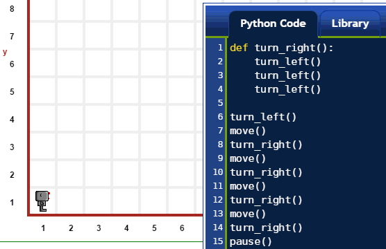
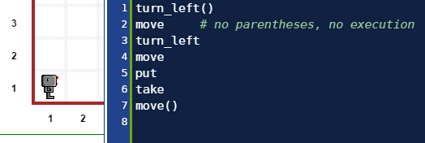
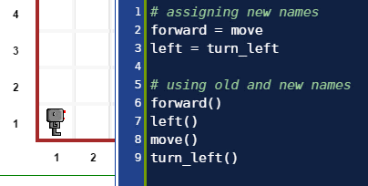

.. warning::

    다음에 나온 교육 내용은 프로그래밍 교재는 **아니다.**
    프로그래밍 교재에는 설명이 있다; 프로그래밍 교재는
    문제를 해결하는데 학습한 것을 활용한 것에 대해 생각하게 만든다.
    프로그래밍 교재는 뭔가 유용한 것을 수애하는데 완전한 프로그램을 
    작성하게 가르침을 준다.

    다음에 나온 교재는 분명하게 유용한 프로그램을 작성하는 방법을 가르치지는 않는다.
    하지만, 파이썬에 대해 일부 배우는데 도움을 준다.

빠르게 파이썬 소개하기: 1부
===================================

파이썬 프로그램은 무엇인가?
----------------------------------

파이썬 프로그램은 연속된 *문장(statement)*이다; 이런 문장이 통상 파일로 (그리고, 리보그 세상에 대한 파이썬 코드 편집기로) 작성되고, 간단한 경우에, 출현되는 순서로 실행된다.

(작성된 코드와 애니메이션 이미지로) 다음에 시연되는 예제는 문장이 7개 포함되어 있다.
각 명령문은 개별 라인에 *함수 호출(function call)*로 나타난다;
예제에서, 서로 다른 함수 3개만 사용했다.

.. code-block:: py3

    move()
    move()
    take()
    move()
    move()
    put()
    move()

|take_put|

.. |take_put| image:: ../../images/take_put.gif

함수란 무엇인가?
----------------------

함수는 연속된 문장에 주어진 **명칭(name)** 으로 
함수가 **호출될(called)** 때 파이썬이 실행할 수 있다.

*잘 모르겠죠?...*

계속, 읽어보세요.

(함수에 대한 ... 혹은 다른 "것"에 대한) 적법한 이름은 무엇일까?
-----------------------------------------------------------------------------

.. note::

    적법한 이름을 구성하는 것에 대한 정확하고 아마도 가장 혼동되는 
    기술은 식별자(identifiers_) 사이트에서 찾을 수 있다.

    .. _identifiers: https://docs.python.org/3.4/reference/lexical_analysis.html#identifiers

정말 단순화해서, 적법한 명칭은 문자, 숫자, *밑줄 문자* (``_``) 로 구성된 어떤 집합으로,
일부 예약 단어가 제외된다. 예약어는 파이썬 *키워드* 로 알려져 있고, 아래에서 살펴볼 것이다.
적법한 명칭은 어떤 문자 혹은 밑줄 단어로 시작될 수 있지만, 숫자는 안된다.
따라서, 적법한 명칭에는 다음이 포함된다:

.. code-block:: py3

   reeborg
   _interesting_name
   C3pio
   _      # 파이썬 프로그래머가 나중에 기억할 필요없는 명칭을 사용할 때 흔히 사용한다.
   UsedRobot

``#`` 기호는 어떤 의미를 가질까?
----------------------------------------

``#`` 기호를 사용해서 주석의 시작을 표기한다.
*주석* 은 프로그래머가 작성한 텍스트로, 다른 사람에게 
의미있게 읽혀지지만, 컴퓨터에게는 의미가 없어 무시된다.
본 상황에서 리보그가 무시한다.
편집기에서, 주석은 코드 나머지와 달리 다른 색깔로 표시되어,
식별되기 쉽게 한다.

함수를 어떻게 정의할까? (파이썬 키워드 ``def``)
-------------------------------------------------------

다음과 같이 파이썬 함수를 새로 정의할 수 있다:

.. code-block:: python

    def some_well_chosen_name ():
        # 코드 몇줄
        # 동일 선상으로 들여쓴다.

``def`` 가 첫번째 파이썬 **키워드**가 된다.
*코드 덩어리* 로 알려진 것에 선행해서 콜론 ``:`` 이 선행해서
함수 *몸통(body)* 을 구성함에 주목한다.
사람 독자가 함수 몸통을 쉽게 식별하도록, 
각 코드 라인 시작부분을 동일 선상으로 *들여쓰기* 하는 것이 파이썬에는 **요구된다.**

첫번째 파이썬 함수를 작성하자::

    def turn_right():
        turn_left()
        turn_left()
        turn_left()

|def|

상기 작성한 것을 반복: 함수가 **호출될** 때, 파이썬이
실행할 수 있는 연속된 문장에 주어진 **명칭** 이 함수다.

함수를 호출하는 방법?
------------------------------

간단히 함수명과 괄호를 친다.
``move`` 가 함수 명칭이고, 
``move()`` 와 같이 작성하면 파이썬에게 함수를 실행하게 명령한다.

**주목:** 함수를 *정의할* 때도,  괄호를 적는다.
하지만, 파이썬이 함수를 실행하지 않는다.
이유는, ``def`` 키워드를 사용할 때는 파이썬이 (아직) 해당 함수를 실행하는 방법을 
모르지만, 곧 실행방법을 알게되기 때문이다.

다음에 ``turn_left()`` 명령어 다음에 ``move()`` 명령을 수행하는 프로그램 예제가 나와 있다::

    turn_left()
    move     # 괄호가 없으면, 실행도 없다.
    turn_left
    move
    put
    take
    move()

|paren|

*사물(thing)* 에 명칭을 부여하는 다른 방법은?
----------------------------------------------------------

.. note::

   만약 다른 프로그래밍 언어를 알고 있다면, 다른 언어에서 
   ``=`` 이 의미하는 것을 잊어버릴 필요가 있다.

파이썬은 등호 ``=`` 를 사용해서 사물에 명칭을 부여할 수 있게 한다.
방식은 다음과 같다::

    name_given_by_you = something_known_to_Python

예를 들어, 다음과 같이 작성한다면::

    five = 2 + 2

``five`` 에 대부분의 사람들이 ``4`` 로 간주하는 명칭이 되는데,
파이썬은 아마도 ``00000000000000000000000000000100`` 으로 알게된다.

파이썬이 알고 있는 주어진 "사물(thing)"은 여러분에게 다양한 명칭이 부여될 수 있다;
파이썬은 이런 모든 명칭이 동등한 것으로 인식한다.

파이썬에서, "사물(thing)"에 대한 기술적 용어는 **객체(object)** 다;
파이썬에서, 파이썬이 알고 있는 모든 것은 **객체다.**

|assign|

명령어 반복 (파이썬 키워드 ``for``, ``in``)
---------------------------------------------------------

.. role:: strike
    :class: strike

정해진 횟수를 반복하는데 사용되는 명령어로 파이썬 숙어가 있다.
저자는 파이썬 숙어를 설명하지는 않을 것이다 - 적어도 이번 시점은 아니다.
파이썬 소개 :strike:`수업`을 이어가는데 단지 필요할 뿐이다.

(특정되지 않은) 명령어를 42회 반복한다고 가정하자. 
파이썬으로 반복작업을 수행하는 방법이 다음에 나와 있다::

    for _ in range(42):
       # 명령어 코드를
       # 동일 선상에서
       # 들여쓰기를 해서
       # 계속해서
       # 적어 나간다.

상기 코드는 **for** 루프로 알려져 있다.

상기 코드에서 파이썬 키워드 **for** 와 파이썬 키워드 **in** 사이에 ``_`` 이 사용된 것에 주목한다;
저자는 어떤 명칭도 선택할 수 있지만, 어떤 명칭을 선택해도 상관이 없어서,
앞에서 언급한 파이썬 관습을 채택했다.

앞에서 살펴본 함수 정의를 다시 작성한 좀더 온전한 예제가 다음에 나와 있다::

    def turn_right():
        for _ in range(3):
            turn_left()

상기 예제에서, 반복되는 코드 덩어리는 단일 문장이 된다.

파이썬 키워드: ``if``, ``True``, ``False``, ``not``
---------------------------------------------------------

다음 프로그램을 고려해 보자::

    if True:
        move()
    if False:
        turn_left()
    if not True:
        turn_left()
    if not False:
        move()

실행 결과가 다음에 나타나 있다:

|if|

.. |if| image:: ../../images/if.gif

``if`` 문장은 일반적으로 다음과 같다::

    if 조건:
       # 여러 줄로 된
       # 코드       
       # 명령문

**만약(if)** ``조건(condition)`` 이 ``참(True)``과 동치일 때만,
"여러 줄로 된 코드 명령문(lines of code)"이 실행된다.
``not False`` 가 완전히 ``True`` 와 동치임에 주목한다.

영어를 알고 있다면, 이 모든 것을 이해하기 쉽다:
``if``, ``True``, ``False``, ``not``, 그리고 많은 파이썬 키워드가
영어 기본 의미에 충실하게 선택되었다.

파이썬 키워드: ``while``
-----------------------------

``while`` 문장은 일반적으로 다음과 같다::

    while 조건:
       # 여러 줄로 된
       # 코드       
       # 명령문

**...동안(while)** 문은 ``조건(condition)`` 이 ``참(True)`` 과 동치일 때만,
"여러 줄로 된 코드 명령문(lines of code)"이 실행되고, 계속해서 반복되고,
``조건(condition)`` 이 ``거짓(False)`` 과 동치일 때만 정지된다.

다음에 기본 명령어를 소개했을 때, 일전에 살펴본 예제가 나와 있다:

|at_goal|

.. |at_goal| image:: ../../images/at_goal.gif

.. topic:: 되돌아가서!

   파이썬 구문에 대한 첫번째 소개라면, "기본 사용설명서"로 되돌아가서 
   다시 살펴보는 것이 아마도 좋은 접근법이 될 것이다:
   앞에서 살펴본 명령어보다 훨씬 더 의미있게 다가올 것이다.
