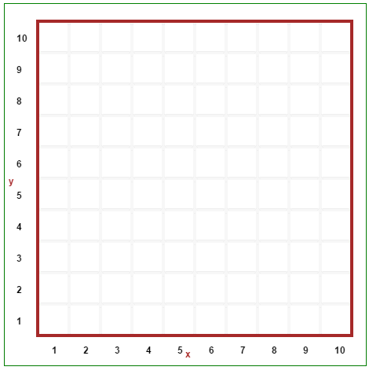
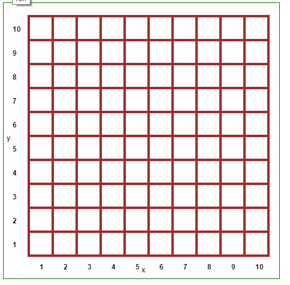

Mazes
=====

In this section, we take a look at automatic maze generation and simple
solutions.  The approach we use to generate mazes is a depth-first
algorithm mentioned on https://en.wikipedia.org/wiki/Maze_generation_algorithm,
with a Python implementation found on
http://rosettacode.org/wiki/Maze_generation#Python.

.. note::

    A quick word about the notation.  ``RUR`` is a general namespace
    used in Reeborg's world; it is named for Reeborg the UsedRobot.

    ``RUR.we`` denotes the functions found in world_editor.js;
    ``RUR.vis_world`` denotes the functions found in visible_world.js.

    world_editor.js contains most of the functions used for the
    graphical world editor.

We first start by creating a grid with all cells surrounded by four walls.
In Reeborg's World, we only record two walls per cell location: one
located to the right ("east") and one located above ("north") of that
location.  The entire *world* itself is surrounded by a border of
walls, so we do not need to generate walls to the right of the last
column or above the upper row.

.. code-block:: python

    def make_filled_maze(w, h):
        '''Creates a maze of size w by h with
           all grid cells surrounded by walls
        '''
        RUR.we.remove_all()
        RUR.vis_world.compute_world_geometry(w, h)
        for i in range(1, w):
            for j in range(1, h):
                RUR.we.toggle_wall(i, j, "east")
                RUR.we.toggle_wall(i, j, "north")
        for i in range(1, w):
            RUR.we.toggle_wall(i, h, "east")
        for j in range(1, h):
            RUR.we.toggle_wall(w, j, "north")

|maze_gen1|

.. important::

   Maze generation examples, in Python and Javascript, are available
   from the world menu.  Usually, the conversion by Brython of
   Python code to Javascript code results in code that runs with
   comparable speed to pure Javascript code.  However, for the
   maze generation case, the Javascript code runs **much** faster.

   One can use the Javascript code to generate mazes (worlds i.e.
   json files) that can be used later with either programming language.

Once we have a grid filled with walls, we transform it into a maze as follows:

1. We pick a random cell
2. We select a random neighbouring cell ...
3. ... that has not been visited
4. We remove the wall between the two cells and add the neighbouring cell
   to the list of cells having been visited.
5. If there are no unvisited neighbouring cell, we backtrack to one
   that has at least one unvisited neighbour; this is done until
   we backtract to the original cell.

This is easily implemented using recursion::

    from random import shuffle, randrange

    def make_maze(w = 16, h = 8):
        visited = [[False] * w + [True] for _ in range(h)] + [[True] * (w + 1)]
        def walk(x, y):
            visited[y][x] = True
            d = [(x - 1, y), (x, y + 1), (x + 1, y), (x, y - 1)]
            shuffle(d)              # 2 randomize neighbours
            for (xx, yy) in d:
                if visited[yy][xx]: # 3 (ignore visited)
                    continue
                if xx == x:
                    RUR.we.toggle_wall(x+1, min(y, yy)+1, "north")  # 4
                elif yy == y:
                    RUR.we.toggle_wall(min(x, xx)+1, y+1, "east")   # 4
                RUR.rec.record_frame()
                walk(xx, yy)     # recursive call; push ahead
                                 # 5; after recursion, effectively backtrack

        walk(randrange(w), randrange(h))  # 1

|maze_gen2|

The above algorithm is adapted from
http://rosettacode.org/wiki/Maze_generation#Python.
An interesting feature of that algorithm is that it
appends extra fake visited list items to avoid generating an ``IndexError``
when reaching index values greater than the size of the lists,
cleverly making use of the fact that ``[-1]`` refers to the last item in a list.
(I wouldn't have thought of that on my own.)

The entire code is the following::

    from random import shuffle, randrange, randint

    # Maze parameters
    max_x = 5
    max_y = 5
    RUR.current_world.small_tiles = False

    # display related options
    RUR.MAX_STEPS = 2000  # bigger for large mazes
    think(30)

    def make_filled_maze(w, h):
        '''Creates a maze of size w by h with
           all grid cells surrounded by walls
        '''
        RUR.we.remove_all()
        RUR.vis_world.compute_world_geometry(w, h)
        for i in range(1, w):
            for j in range(1, h):
                RUR.we.toggle_wall(i, j, "east")
                RUR.we.toggle_wall(i, j, "north")
        for i in range(1, w):
            RUR.we.toggle_wall(i, h, "east")
        for j in range(1, h):
            RUR.we.toggle_wall(w, j, "north")
        RUR.rec.record_frame()

    def make_maze(w = 16, h = 8, name="maze"):
        '''Adapted from
           http://rosettacode.org/wiki/Maze_generation#Python

           "name" is the value used to save the maze in the
           browser's local storage so that it is available
           if the page is reloaded.
        '''
        make_filled_maze(w, h)
        pause(500)
        vis = [[False] * w + [True] for _ in range(h)] + [[True] * (w + 1)]
        def walk(x, y):
            vis[y][x] = True
            d = [(x - 1, y), (x, y + 1), (x + 1, y), (x, y - 1)]
            shuffle(d)
            for (xx, yy) in d:
                if vis[yy][xx]:
                    continue
                if xx == x:
                    RUR.we.toggle_wall(x+1, min(y, yy)+1, "north")
                elif yy == y:
                    RUR.we.toggle_wall(min(x, xx)+1, y+1, "east")
                RUR.rec.record_frame()
                walk(xx, yy)

        walk(randrange(w), randrange(h))

        reeborg = UsedRobot(randint(1, max_x), randint(1, max_y))
        RUR.we.add_object("star", randint(1, max_x), randint(1, max_y), 1)
        RUR.rec.record_frame()
        RUR.storage.save_world(name)

    def turn_right():
        turn_left()
        turn_left()
        turn_left()

    make_maze(max_x, max_y)
    pause(500)

    while not object_here():
        if right_is_clear():
            turn_right()
            move()
        elif front_is_clear():
            move()
        else:
            turn_left()

It includes the addition of a robot, a star, and a
quick method for the robot to find the star.

|maze_gen2b|

.. |maze_gen2b| image:: ../../images/maze_gen2b.gif

The lines ``RUR.rec.record_frame()``
are instructions to "take a snapshot"  (or "record
a frame") of the world's state at that point.  In case you have
not read the rest of the documentation: in Reeborg's World,
programs are first run entirely in the background, with various frames
being recorded; the series of frames are then played back, one at a
time, with a delay that can be adjusted using ``think(ms)``, which is
supposed to represent the amount of time taken by the robot to think
between each action.
``RUR.storage.save_world(name)`` saves the maze in the browser's local
storage, so that it could be retrieved when accessing Reeborg's World
at a later time (using the same browser, of course).   We've also
added a robot and an object to find.  The strategy used by the robot
to find the object consists in "following the right wall", moving in
such a way that a wall is always present to its immediate right.

Note that we've also included various calls to ``pause()``, useful
for having a closer look at various stages.

**Note: while the frames are being recorded, the display
is effectively frozen.** [As mentioned above, the pure Javascript code
is **much** faster and do not cause such long delays.]
For example, it took 40 seconds before the following started to display:

|maze_gen3|

.. |maze_gen3| image:: ../../images/maze_gen3.gif

.. topic:: How to use for students

    If one wants to have worlds based on some randomly generated mazes,
    the preferred approach would be to include the maze-generation code
    in the "pre-code" part of the world, so that the Editor would contain
    only the student's code.
