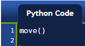

첫번째 프로그램
=============

.. index:: move(), function

사용지침서 초반에 주어진 명령지침을 따랐다면, 리보그 첫걸음을 방금 전에 내딛였다. 편집창(editor panel)에, 명령어가 하나있다.::

    move()

``move()`` 는 파이썬 **함수(function)**의 한가지 사례다. 함수는 이름이 있다; 이 경우에, 이름이 ``move``다. 적법한 명칭은 문자 혹은 밑줄 문자 "_"로 시작해야 되고, 문자, 숫자, 혹은 밑줄 "_"을 포함할 수 있다.
함수 명칭 다음에 ``()`` 괄호 적는다. 이것이 리보그(파이썬)으로 하여금 함수는 *실행되거나* 혹은 *호출되어야* 됨을 일러준다. 여기서 실행(execute)과 호출(call)은 유의어다. 함수는 그 차제로 한줄이여야만 된다. [추후에 이것에 대한 예외를 볼 것이다.]

종종, 프로그램을 시각적으로 표현하는 **순서도(flowchart)**를 그린다. 순서도로 표현하면, ``move()`` 같은 단일 명령어는 다음과 같이 표현될 수 이다:

.. figure:: ../../../flowcharts/move1.jpg
   :align: center

그리고, 단일 명령어를 담고 있는 완전한 프로그램은 다음과 같이 표현될 수 있다:

.. figure:: ../../../flowcharts/move.jpg
   :align: center

순서도에서, 명령어 순서는 화살표를 따라간다. "시작(Start)"에서 출발해서 "중지(Stop)"에서 멈춘다.

.. topic:: 시도해 보기!

    두번째 ``move()`` 명령어를 추가해서, 한번 전진하는 대신에 리보그가 두번 전진하게 한다.

.. hint::

   코드를 적은 첫줄 시작점에 공백없이, 각 명령어가 해당 줄에 온전히 나타나야만 된다.

오류(eRRoRs) 처리
-------------------

컴퓨터 프로그램을 작성할 때, 아마도 많은 오류를 만들것이다. 리보그가 오류에 어떻게 반응하는지 살펴보기 위해서, 프로그램에 의도적으로 오류 한개를 도입해본다.

.. topic:: 시도해 보기!

    ``move()``를  ``Move()``(대문자 M)로 변경하고 프로그램을 실행해 본다.

어떤 일이 발생했나요?
~~~~~~~~~~~~~~

리보그가 이해하는 언어, 파이썬은 "대소문자를 구별"한다; 즉, 소문자가 대문자와 다른 의미를 갖는다. 리보그가 오류처리하는 방법을 살펴봤기 때문에, 돌아가서, 프로그램을 고치고, 올바른 버젼으로 실행한다.

규칙 #1
-------

위에서 저자가 제시한 모든 것을 시도해봤나요? 만약 그렇지 않다면, 다시 돌아가서 수행을 직접하도록 촉구합니다. 만약 프로그래밍을 배우려고 한다면 지켜야만 되는 가장 중요한 규칙이 다음에 나와있다:

.. index:: 규칙 # 1

.. important::

    규칙 # 1
        컴퓨터 프로그램을 배우는 것은 마치 음악 악기를 배우는 것과 같습니다: 단지 읽는 것만으로는 부족하고, 여러분이 **직접 프로그램을 작성**해봐야 합니다. 

매번 저자가 무언가 시도해보라고 제시할 때마다, 실습하는데 대해서 뭔가 이유가 있다. 때때로, 당장 명백해보지 않을 수도 있지만, 저자는 여러분이 실습하도록 적극 권장합니다. 저자가 제시하는 것 이상, 더 멀리 탐색하도록 다른 것도 직접하도록 적극 권장합니다.

여러분을 도와줄 특별한 도구
---------------------------

리보그 세상(Reeborg's World) 상단에, **Reeborg's keyboard**라는 이름의 버튼이 있다. 만약 이 버튼을 클릭하면, 특수 키보드가 나타난다. 각 버튼을 클릭함으로써, 상응하는 명령어, 파이썬 키워드 등이 자동으로 편집기에 삽입된다. 이름이 올바르게 입력되고, 필수 괄호를 빼먹지 않게 확실히 하는데 유용하다.

.. admonition:: 선생님께

    리보그 키보드는 다음 세가지 범주에 속한 사용자에게 특히 유용하다: 정규 키보드를 타이핑하는데 어려움을 갖는 어린 친구들, 터치 화면을 사용하는 사용자, 비영문 자판을 사용하거나 파이썬에 필요한 일부 기호를 입력하는데 어려움을 갖는 사용자.

    리보그 키보드에는 사용설명서에 문서화되지도 않고 온라인 도움말에도 나와 있지 않는 명령어가 하나 포함되어 있다. 이런 유형의 누락이 다른 명령어에도 일어날 수 있다... 만약 이런 경우가 있다면, 저자가 필요한 수정을 할 수 있도록 연락을 주세요.