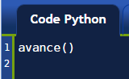

Premier programme
=================

Si vous avez suivi les instructions correctement, Reeborg a fait ses premiers
pas.  Dans l'onglet "Code Python" se trouve une seule instruction::

    avance()

``avance()`` est un exemple d'une **fonction**.
Une fonction a un nom; dans ce cas-ci, c'est ``avance``.
Pour être valide, les noms doivent débuter soit par une lettre ou par le
caractère de soulignement "_",
et peuvent contenir des lettres, des chiffres ou le caractère
de soulignement.
Le nom de le fonction peut être suivi par des parenthèses ``()``.
La présence des parenthèses indique à Reeborg (Python) que la fonction doit être *exécutée*.
La fonction doit être sur sa propre ligne (nous verrons des exceptions à ceci plus tard).

Occasionnellement, nous ferons des **organigrammes** qui sont une représentation graphique
d'un programme.  Dans un organigramme, une simple instruction comme
``avance()`` pourrait être représentée de la façon suivante:

.. figure:: ../../flowcharts/avance1.png
   :align: center

et un programme complet, comprenant seulement cette instructions, serait représenté
comme suit:

.. figure:: ../../flowcharts/avance.jpg
   :align: center

Dans un organigramme, la séquence des instructions suit les flèches.

.. topic:: Essayez ceci!

    Ajouter une seconde instruction ``avance()`` faisant en sorte que Reeborg fasse deux pas plutôt qu'un seul.

.. hint::

   Chaque instruction doit apparaître sur sa propre ligne, sans espace
   superflu au début de la ligne.

Composer avec les eRReuRs
--------------------------

Lorsque vous allez écrire des programmes, vous allez occasionnellement faire des erreurs.
Pour voir comment Reeborg réagit lorsqu'il rencontre des erreurs, je vous demande
d'en faire une de façon intentionnelle.

.. topic:: Essayez ceci!

    Changez ``avance()`` à ``Avance()`` (avec un A majuscule) et exécutez le programme.

Qu'est-il arrivé?
~~~~~~~~~~~~~~~~~

Tout d'abord, je note que le message d'erreur indique **NameError**:
Les messages d'erreurs comportent parfois des termes anglais, mais ceci est
malheureusement incontournable...

Python, le langage que Reeborg comprend, est "sensible à la casse";
c'est-à-dire que les lettres majuscules et les lettre minuscules ont des
sens différents. Corrigez-donc le programme pour que Reeborg soit en
mesure de le comprendre et vérifiez que cela est bien le cas.

Lorsque vous aurez exécuter le programme à nouveau, les indications
d'erreurs seront effacées. Assurez-vous que ceci soit bel et bien le
cas.

Règle no 1
----------

Est-ce que vous avez bel et bien essayez toutes les suggestions
ci-dessus?  Sinon, je vous implore de le faire.  Voyez-vous, la
règle la plus importante que vous devez suivre pour apprendre
à programmer est la suivante:

.. important::

    Règle no 1
        Apprendre la programmation informatique est comme apprendre à jouer
        d'un instrument de musique: il faut le faire et non pas se contenter de lire à ce sujet.

Chaque fois que je vous suggère d'essayer quelque chose, j'ai une raison bien
précise pour le faire.  Parfois, cette raison ne vous sera pas évidente, mais
je vous encourage fortement de toujours essayer.  En fait, je vous encourage
à essayer d'autres exemples de votre cru, ce qui vous permettra d'approfondir
votre compréhension.

Un outil pour vous aider
------------------------

Tout en haut du Monde de Reeborg, vous verrez un bouton intitulé
**Clavier de Reeborg**.  Si vous cliquez dessus, un clavier spécial
apparaitra.  En cliquant sur différent bouton, vous pouvez insérer
des instructions utiles pour Reeborg ... tout en évitant de faire
des erreurs en oubliant des parenthèses requises, ou en épelant incorrectement
un mot.

.. admonition:: Pour les enseignants

    Le clavier de Reeborg peut être particulièrement utile pour trois
    catégories de programmeurs: les plus jeunes, qui ne maitrise pas
    un clavier "normal", ceux qui utilisent des écrans tactiles
    avec clavier virtuels, et ceux qui utilisent un clavier avec
    certains symboles requis difficiles à entrer.

    Au moment où j'édite ce tutoriel pour rajouter cette note,
    je viens tout juste de rajouter le clavier de Reeborg ainsi qu'une
    commande (``pas de surlignement``) qui n'est pas documentée dans
    ce tutoriel (ni dans l'aide en ligne).  Ceci risque d'arriver au
    sujet d'autres commandes ... n'hésitez pas à me contacter si vous
    voyer des erreurs (possiblement par omission) dans ce tutoriel
    pour que je puisse les corriger.

