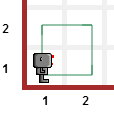

.. topic:: Try this!

    Before reading the rest of this lesson, 
    write a program that makes Reeborg draw a square as illustrated on
    this image: |image0|
    

.. hint::

    If you do not know how to, select world **Alone** and 
    review the commands seen in `Test driven learning <home.html>`_

Reeborg goes to France
======================

-  *Quelque chose à déclarer Monsieur. ... Reeborg?*
-  ``Je ne parle pas français .... I do not speak French.``
-  *Do you have something to declare?*
-  ``Perhaps I should ...``

Reeborg is known internationally and travels often. It might be useful
to teach him words in a different language. For functions, this can be
done using the Javascript keyword ``var``. I like to think of ``var`` as
creating some ``var``\ iation of the language. However, in programming terms,
this is simply known as **declaring** a ``var``\ **iable**.

We can do this in either one or two steps.
    
.. note::

   On line 1 we define a new word and give it a meaning on line 2. On line
   3 we do both steps at once. Notice
   the absence of parentheses.
   We can then use the new functions names; the old ones still work
   as we show on the last line.

.. code-block:: javascript
    :linenos:

    var forward;
    forward = move;
    var turnLeft = turn_left;

    forward();
    turnLeft();
    move();
    
    

.. topic:: Try it!

    Choose your own names for ``move`` and ``turn_left`` and use them
    to make Reeborg draw a square.  If your computer has speakers, you
    might want to add the instruction ``sound(true)`` at the very beginning
    of your program for a bit of added fun.

Perhaps you could define your own language for giving instructions to
Reeborg?

.. important::

    **Keywords** are
    names in a programming language that are assigned some special meaning
    that will be the same independently of who writes the program. Note how
    the ``var`` keyword above appears in a different colour in the Javascript
    editor: 
    all Javascript keywords will be identified similarly.

Valid names
-----------

.. note::

    If you have learned some Javascript elsewhere, you have seen that the
    ``var`` keyword is not normally required. If you choose the "regular"
    version of Javascript instead of the **strict** one, you will see
    that you can avoid using the ``var`` keyword.  However, this is considered
    to be a bad practice. 

For now, limit yourselves with names that start with a letter and
contain only letters, numbers or the underscore character "\_"; a name
can **not** have a space in it - which is why many people use the
underscore character to create names that look like many words that
would be a phrase; thus, instead of *turn left*, we can write ``turn_left``.
An alternative way to write compound names most often used by Javascript
programmers is known as camelCase, where the start of a new word is
indicated by an uppercase letter.  We gave one such example above with
``turnLeft``.

