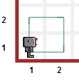

.. topic:: Try this!

    Before reading the rest of this lesson, 
    write a program that makes Reeborg draw a square as illustrated on
    this image: |image0|
    

.. hint::

    If you do not know how to, select world **Alone** and 
    review the commands seen in `Test driven learning <home.html>`_

Reeborg goes to France
======================

-  *Quelque chose à déclarer Monsieur. ... Reeborg?*
-  ``Je ne parle pas français .... I do not speak French.``
-  *Do you have something to declare?*
-  ``Perhaps I should ...``

Reeborg is known internationally and travels often. It might be useful
to teach him words in a different language. This can be done quite easily with
Python.

.. note::

   On lines 1 and 2, we define some new function names (synonyms, or aliases); notice
   the absence of parentheses.
   On lines 4 and 5, we use the new functions names; the old ones still work
   as we show on line 6.

.. code-block:: python
    :linenos:

    forward = move
    turnLeft = turn_left

    forward()
    turnLeft()
    move()

.. topic:: Try it!

    Choose your own names for ``move`` and ``turn_left`` and use them
    to make Reeborg draw a square.  If your computer has speakers, you
    might want to add the instruction ``sound(true)`` at the very beginning
    of your program for a bit of added fun.

Perhaps you could define your own language for giving instructions to
Reeborg?

Valid names
-----------

.. note::

    Reeborg's world uses Brython to translate Python 3 code into Javascript
    that can then be executed in the browser.  While Python 3 allows you to 
    have variable names that contain non-English letters, such as é,
    Brython does not recognizes these characters. 

For now, limit yourselves with names that start with a letter and
contain only letters, numbers or the underscore character "\_"; a name
can **not** have a space in it - which is why many people use the
underscore character to create names that look like many words that
would be a phrase; thus, instead of *turn left*, we can write ``turn_left``.
An alternative way to write compound names most often used by non-Python
programmers is known as camelCase, where the start of a new word is
indicated by an uppercase letter.  We gave one such example above with
``turnLeft``.

